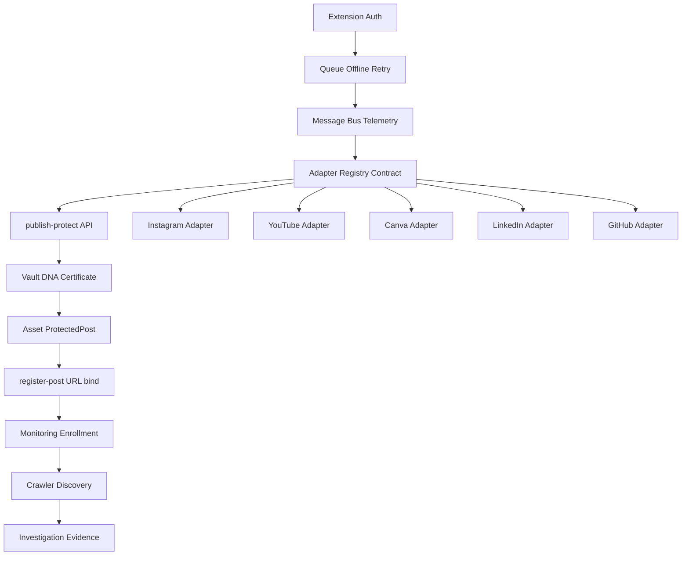

# 14 — PinIT Extension Implementation Roadmap

**Status:** Execution plan (final documentation gate before coding)  
**Audience:** Engineering, QA, Product  
**Rule:** After this document, stop expanding architecture. Implement module by module.

---

## 1. Purpose

This roadmap is the bridge between the architecture package and day-to-day coding. It answers:

- What is Sprint 1 through Sprint 10?
- Which module depends on which?
- Which APIs must exist before adapters harden?
- Which database tables are already present vs still additive?
- Which adapters are MVP, Beta, Production, Enterprise?
- What “done” means for each release gate?

It does **not** redefine product vision. Specs remain:

| Spec role | Primary source |
|---|---|
| System architecture | [`docs/PINIT_EXTENSION_ECOSYSTEM_ARCHITECTURE.md`](./PINIT_EXTENSION_ECOSYSTEM_ARCHITECTURE.md) |
| Adapter contracts | [`docs/PLATFORM_ADAPTER_SPECIFICATIONS/`](./PLATFORM_ADAPTER_SPECIFICATIONS/) |
| Shared adapter interface | [`docs/PLATFORM_ADAPTER_SPECIFICATIONS/ADAPTER_INTERFACE.md`](./PLATFORM_ADAPTER_SPECIFICATIONS/ADAPTER_INTERFACE.md) |
| Interactive summary | Cursor canvas `pinit-extension-ecosystem-architecture.canvas.tsx` |

---

## 2. Documentation Map (Architecture Package ↔ This Repo)

The enterprise checklist of “13 companion docs” maps onto existing PinIT documents as follows. Do **not** rewrite them as a new numbered series unless product explicitly requires packaging for an external engineering handoff.

| Checklist ID | Intent | Existing PinIT source |
|---|---|---|
| 01 Extension Architecture | MV3 runtime, queues, adapters | `PINIT_EXTENSION_ECOSYSTEM_ARCHITECTURE.md` §§6–8, `extension/` |
| 02 Platform Adapter Spec | Per-platform contracts | `PLATFORM_ADAPTER_SPECIFICATIONS/*` |
| 03 Browser API Reference | Permissions, MV3 limits | Architecture §§22, 40 |
| 04 Event Catalog | Message bus / telemetry events | `ADAPTER_INTERFACE.md` telemetry + architecture message bus |
| 05 Data Flow | Capture → protect → monitor | Architecture §§8–11 |
| 06 Sequence Diagrams | End-to-end sequences | Architecture §10 (mermaid) |
| 07 Crawler Connectors | Monitoring connectors | Architecture §§12–13 |
| 08 AI Services | Matching / risk AI | Architecture §15; `python-ai/` |
| 09 Security Guide | Crypto, tenancy, permissions | Architecture §§22–23, 40, 49 |
| 10 Deployment Guide | Store / staging / prod | Architecture §47 |
| 11 Testing Guide | Adapter / recovery tests | Architecture §46 + per-adapter checklists |
| 12 Operations Runbook | Metrics, alerts, recovery | Architecture §§36, 48 |
| 13 Product Capability Matrix | Browser / OAuth / impossible | Architecture §§18–19, 33, 39 |
| **14 Implementation Roadmap** | **This file** | **Execution plan** |

---

## 3. Current Code Baseline (Do Not Rebuild From Zero)

PinIT already has a working foundation. Sprints should **harden and complete**, not rewrite.

### Extension already present

| Module | Location | Maturity |
|---|---|---|
| MV3 service worker | `extension/background/service-worker.js` | Working |
| Shared file-input adapter | `extension/shared/adapter-interface.js` | Working (needs contract alignment) |
| Offline / retry queue | `extension/shared/queue.js` | Working |
| API client + auth refresh | `extension/shared/api.js`, `config.js` | Working |
| Platform wrappers | `extension/content/adapters/*.js` | Thin; need reliability |
| Export protect | `extension/content/export-protect.js` | Heuristic |
| Popup / options | `extension/popup/*`, `options/*` | Working |

### Backend already present

| Capability | Entry | Maturity |
|---|---|---|
| Auth for extension | `/auth/extension/issue-code`, `/auth/extension/token` | Working |
| Protect pipeline | `POST /extension/publish-protect` | Working |
| Late URL bind | `POST /extension/register-post` | Working |
| Extension sync | `GET /extension/sync` | Working |
| Vault / DNA / Certificate | existing services | Working |
| Monitoring enroll | Publish Guardian → monitoring service | Working |
| Asset aggregate | `asset.service` + `Asset` model | Additive / working |
| Investigation | unified investigation orchestrator | Working |
| Crawler jobs | crawler engine + DB queue | Working |

### Database tables already present (create-first is largely done)

Create / extend only when a sprint explicitly needs a gap:

| Table / model | Status for roadmap |
|---|---|
| `DnaRecord`, `VaultRecord`, `Certificate` | Exist — use |
| `MonitorRecord`, crawler job tables | Exist — use |
| `ProtectedPost`, timeline, discovery | Exist — use |
| `Asset`, asset timeline/discovery | Exist — use |
| `ExtensionAuthCode` | Exist — use |
| `ForensicProvenanceEvent`, `AuditEvent` | Exist — use |
| First-class `Investigation`, `Alert`, `PlatformLink` | Partially implicit — **Enterprise / later sprints** |

**Implication:** Sprint 1–3 are framework hardening + reliability, not greenfield schema.

---

## 4. Dependency Graph

### Hard rules

1. **Do not** harden a second social adapter until Instagram **or** YouTube captures originals reliably end-to-end.
2. **Do not** start enterprise SSO/RBAC before MVP protect + one adapter + monitoring enrollment work.
3. **Do not** block platform uploads waiting for DNA/certificate completion (async queue-first remains mandatory).
4. Adapter work depends on: Auth + Queue + `PUBLISH_CAPTURE` path + `publish-protect` + `pageUrl`/`platform` metadata.

### APIs that must be stable before adapter hardening

| API | Required by |
|---|---|
| `POST /auth/extension/token` (+ issue-code from Hub) | All extension work |
| `POST /extension/publish-protect` | All capture adapters |
| `POST /extension/register-post` | Late public URL binding |
| `GET /extension/sync` | Multi-browser / recovery UX |
| Vault / DNA / Certificate (internal via Publish Guardian) | Asset protection |
| Monitoring enroll (via Publish Guardian) | Post-protect monitoring |

Optional later (not Sprint 1 blockers):

- `POST /extension/link-platform-url` (if split from register-post)
- `POST /extension/telemetry/batch`
- `POST /extension/heartbeat`

---

## 5. Release Definitions

| Gate | Meaning | Must be true |
|---|---|---|
| **MVP** | One reliable “upload once, protect automatically” path | Auth + queue + Instagram **or** YouTube capture → Vault → DNA → Certificate → Monitoring enroll; platform upload uninterrupted |
| **Beta** | 3–5 adapters + late URL bind + visible degraded states | Instagram, YouTube, Canva; LinkedIn or GitHub; side panel/popup queue health; adapter telemetry |
| **Production** | Chromium store-ready + ops | Chrome Web Store package; regression suite; dashboards for protect success / adapter failures / queue backlog; capability matrix published |
| **Enterprise** | Org controls + OAuth enrichment | SSO/RBAC/policy; API-assisted connectors where needed; legal hold; audit export |

### Adapter tiers

| Tier | Adapters |
|---|---|
| **MVP** | YouTube Studio **or** Instagram (pick one primary; harden second next) |
| **Beta** | Instagram, YouTube Studio, Canva, LinkedIn, GitHub |
| **Production+** | Facebook, WordPress, Shopify |
| **Enterprise enrichment** | Google Drive / Dropbox / Slack / M365 (OAuth/API-first) |

Recommended primary MVP adapter: **YouTube Studio** (file picker + drag-drop + large-file reliability), with Instagram as Sprint+1.

---

## 6. Sprint Plan

Assumptions: ~1–2 week sprints; one focus thread; no parallel “all platforms at once.”

| Sprint | Deliverable | Depends on | Exit criteria |
|---|---|---|---|
| **Sprint 1** | Extension core + Auth | Existing Hub auth | Sign-in, token refresh, options config, status badge, no silent auth failures |
| **Sprint 2** | Queue + Offline + Retry | Sprint 1 | Queue survives restart; backoff works; `clientRequestId` idempotent; badge shows Q / ✓ / ! |
| **Sprint 3** | Asset protection path hardening | Sprint 2 + existing backend | Capture → `publish-protect` always creates Asset + ProtectedPost + Vault + DNA + Certificate (or clear degraded state); `pageUrl` + `platform` stored |
| **Sprint 4** | Instagram adapter reliability | Sprint 3 + `01_INSTAGRAM.md` | File picker (+ drag-drop where possible); logs full stage chain; post URL late-bind via `register-post` |
| **Sprint 5** | YouTube Studio adapter reliability | Sprint 3 + `02_YOUTUBE_STUDIO.md` | File picker + drag-drop; large video; public URL pending → bound; YouTube upload never blocked |
| **Sprint 6** | Canva export adapter | Sprint 3 + `03_CANVA.md` | Export capture without blocking export; Vault/DNA/Certificate created |
| **Sprint 7** | Monitoring (URL register + discovery wire-up) | Sprint 4–5 | Watch URLs updated; crawler jobs enqueue; discoveries appear on ProtectedPost/Asset |
| **Sprint 8** | Investigation + alerts UX | Sprint 7 | Discovery → investigation entry path; risk/severity visible; evidence package reachable from Hub |
| **Sprint 9** | LinkedIn + GitHub adapters (Beta set) | Sprint 3 + specs `05`, `07` | One adapter at a time; same contract as Sprint 4–5 |
| **Sprint 10** | Production release | Sprints 1–8 | Store package, regression suite, ops dashboards, capability matrix published, staged rollout |

### Mapping to five implementation phases

| Phase | Sprints | Focus |
|---|---|---|
| Phase 1 — Foundation | 1–3 | Framework, registry, message bus, queue, auth, telemetry |
| Phase 2 — First adapters | 4–6, 9 | Instagram → YouTube → Canva → LinkedIn → GitHub (serial) |
| Phase 3 — Backend integration | 3 (ongoing) | Vault, DNA, Certificate, Monitoring, Timeline, Asset, ProtectedPost |
| Phase 4 — Monitoring | 7–8 | URL registration, discovery, crawler, alerts, investigation |
| Phase 5 — Production | 10 | Load tests, Chrome Store, enterprise deploy later, dashboards, ops |

---

## 7. Sprint 1–3 Detail (Foundation)

### Sprint 1 — Extension Core + Auth

**Build / harden**

- Auth connect UX (issue-code → token) reliability
- Config migration for API/Hub URLs
- Popup: signed-in state, last protect/verify, open Hub
- Structured logging prefixes (`[PinIT]`)

**Do not**

- New platforms
- New backend tables
- Side panel (defer to Beta unless trivial)

**Done when**

- Fresh install → connect → authenticated → status sync works on Chrome

### Sprint 2 — Queue + Offline + Retry

**Build / harden**

- Queue durability across service-worker restart
- Offline enqueue when signed-out or offline
- Alarm flush + startup flush
- Cap / prune / failed-state visibility in popup

**Done when**

- Kill browser mid-upload → reopen → queue drains successfully without duplicate Asset (idempotent `clientRequestId`)

### Sprint 3 — Asset Protection Path

**Build / harden**

- Align `PUBLISH_CAPTURE` payload with adapter contract (`platform`, `pageUrl`, `postUrl`, `capturedVia`)
- Ensure backend stores platform + URL on Asset / ProtectedPost metadata
- Explicit stage logs: queued → vault → DNA → certificate → monitoring
- Degraded states if certificate or monitoring fails without losing Vault original

**Done when**

- Manual protect **and** one adapter path produce Asset in Hub with `sourcePlatform` + source/page URL

---

## 8. Sprint 4–6 Detail (First Adapters — One At A Time)

### Order

1. Instagram (`01_INSTAGRAM.md`) — Sprint 4  
2. YouTube Studio (`02_YOUTUBE_STUDIO.md`) — Sprint 5  
3. Canva (`03_CANVA.md`) — Sprint 6  

**Rule:** Finish reliability checklist for adapter N before starting N+1.

### Per-adapter Definition of Done

- Matches capability classification in its spec (browser-only vs OAuth vs unavailable)
- File picker and/or export path verified on live site
- Stage logs visible in page console + service worker
- Protect does not block platform upload/export
- Asset appears in Vault with DNA + Certificate (or degraded marked)
- Failure modes from the spec have automated or checklist tests

### Explicitly out of scope during adapter sprints

- Video DNA deep features beyond current DNA pipeline
- HubSpot/Marketo
- Redis workers rewrite
- New platforms beyond the sprint’s single adapter

---

## 9. Sprint 7–8 Detail (Monitoring + Investigation)

### Sprint 7 — Monitoring

- Ensure watch URLs include `pageUrl` / `postUrl` / profile when available
- Late `register-post` updates monitoring profile
- Confirm crawler job creation for enrolled DNA
- Operator-visible monitoring status on Asset / ProtectedPost

### Sprint 8 — Investigation

- Discovery → investigation entry from Hub
- Timeline events for discovery / tamper
- Evidence package access path
- Alerts (notification / platform event) for high severity — use existing surfaces first; first-class `Alert` table only if blocking

---

## 10. Sprint 9–10 Detail (Beta Completion + Production)

### Sprint 9 — LinkedIn then GitHub

Serial implementation against `05_LINKEDIN.md` and `07_GITHUB.md`. Same DoD as §8.

Defer Facebook / WordPress / Shopify to post-Production unless product reprioritizes.

### Sprint 10 — Production Release

- Chrome Web Store packaging + privacy / permission justification
- Edge packaging if ready
- Adapter regression smoke suite
- Ops: protect success rate, failed captures, queue backlog, adapter failure by platform
- Publish public capability matrix (browser / OAuth / impossible)
- Staged rollout + rollback plan for adapter regressions

---

## 11. Database Creation Order (If Additive Work Is Needed)

Prefer existing models. If Enterprise sprints require new first-class tables, create in this order:

1. Keep using `Asset` + `ProtectedPost` as write path  
2. Additive `PlatformLink` (only if URL binding outgrows ProtectedPost fields)  
3. First-class `Investigation` aggregate (stabilize string IDs)  
4. First-class `Alert` aggregate (dedupe / ack / escalate)  
5. Unified `TimelineEvent` projection (read model, not rewrite of provenance)

**Do not** create these in Sprint 1–5.

---

## 12. Team Execution Rules

1. One adapter in flight at a time.  
2. Spec file is the contract; code follows `PLATFORM_ADAPTER_SPECIFICATIONS`.  
3. Capture failures get telemetry + queue recovery — never silent drop.  
4. No new architecture markdown unless a production incident proves a gap.  
5. Implementation PRs reference: sprint ID + adapter spec path + exit criteria.  
6. Prefer hardening `adapter-interface.js` / service worker / Publish Guardian over new parallel frameworks.

---

## 13. Immediate Next Coding Task (After This Doc)

**Start Sprint 1–3 delta only if auth/queue gaps remain; otherwise begin Sprint 5 (YouTube) or Sprint 4 (Instagram) reliability.**

Recommended first implementation ticket:

> Harden YouTube Studio upload capture against `02_YOUTUBE_STUDIO.md`: file input + drag-drop, stage logging, async queue, `pageUrl`/`platform` on Asset, non-blocking YouTube upload, retry on backend failure. Do not start Canva/LinkedIn until YouTube DoD passes.

---

## 14. Stop Line

| Activity | After this roadmap |
|---|---|
| New architecture chapters | **Stop** |
| New platform specs (unless new MVP platform) | **Stop** |
| Implementation design tickets / PRs | **Start** |
| Adapter coding | **Start** (one at a time) |

This document is the last planned documentation gate. Everything after it should be code, tests, and release ops.

---

## 15. Execution Progress (living)

Updated when implementation behavior ships (not for architecture expansion).

| Sprint | Status | Notes |
|---|---|---|
| Sprint 1 Auth / health / popup | **Done (v1.3.0)** | Health heartbeat, GET_STATUS version/health, popup queue + degraded states |
| Sprint 2 Queue / offline / retry | **Done (v1.3.0)** | Stuck-processing recovery, large-payload gate, markQueueItemDone, mediaUrl retry path |
| Sprint 3 Protect pipeline | **Done (v1.3.0)** | Degraded flags for missing cert/monitor; pageUrl on protect; immediate large-file upload |
| Sprint 4 YouTube Studio | **In debug (v1.3.4)** | MAIN-world file hook + stage checklist in popup + open-shadow scan — **live Studio Asset DoD still open** |
| Sprint 5 Instagram | Not started | Blocked until YouTube live DoD |
| Tests | Expanded | + `shadow-file-input.test.ts`, `scripts/extension-capture-selftest.mjs`, mock upload HTML |

**Sprint 4 debug (current):** structured logs cover dialog scan → file input hook → change → file object → sendMessage → SW `PUBLISH_CAPTURE` → enqueue → process → publish-protect response → `process.failure` with id/error/stack. Popup shows last failure id + reason. Use **Run pipeline self-test** to verify Asset creation without Studio; then confirm Studio upload still attaches to shadow `<input type="file">`.

**Live QA still required for Sprint 4 DoD:** load unpacked `extension/` v1.3.1 → sign in → self-test creates Asset → Studio upload → confirm Asset/Vault/Certificate/Monitoring + non-blocking YouTube upload.
