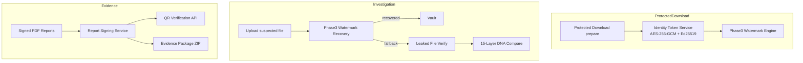

# DNA Engine Phase 3 — Enterprise Watermark & Evidence Engine

## Summary

Additive Phase 3 layer (v2.3) for production-grade watermark embedding, encrypted identity tokens, signed PDF reports, evidence ZIP packages, and QR verification. **All flags default OFF** — existing workflows unchanged.

---

## Architecture

---

## Feature Flags

| Flag | Default | Purpose |
|------|---------|---------|
| `DNA_PHASE3_ENABLED` | `false` | Master Phase 3 switch |
| `DNA_P3_PROTECTED_DOWNLOAD_TOKEN` | `true`* | Encrypted identity token on protected download |
| `DNA_P3_WATERMARK_EMBED` | `true`* | File-type watermark embedding |
| `DNA_P3_WATERMARK_RECOVERY` | `true`* | Recovery before DNA compare fallback |
| `DNA_P3_SIGNED_REPORTS` | `true`* | Ed25519-signed report manifests + QR |
| `DNA_P3_EVIDENCE_PACKAGE` | `true`* | Full evidence ZIP structure |
| `DNA_P3_VAULT_WATERMARK` | `true`* | Vault-store watermark (requires below) |
| `INVISIBLE_WATERMARK_EMBEDDING_ENABLED` | `false` | Vault-time invisible watermark |
| `PHASE3_SIGNING_SECRET` | — | HMAC/AES key namespace |
| `PHASE3_ED25519_PRIVATE_KEY_PEM` | — | Stable production signing key |

\*Sub-flags only apply when `DNA_PHASE3_ENABLED=true`.

---

## Deliverables

### 1. Protected Download Identity Token
- **Files:** `identity-token.service.ts`, `phase3-crypto.service.ts`
- Opaque AES-256-GCM payload (vault/dna/cert IDs encrypted, not cleartext in file)
- Ed25519 signature, version, nonce, issue timestamp
- Embedded via `phase3WatermarkEngine` when `DNA_P3_PROTECTED_DOWNLOAD_TOKEN=true`

### 2. Watermark Embedding Engine
- **Files:** `phase3-watermark-engine.service.ts`, `phase3/image-dct-watermark.ts`
- Images: DCT mid-frequency + LSB fallback
- PDF: object streams + metadata + tail marker
- DOCX: custom XML properties
- Audio/Video: frequency-domain tail markers (extensible)
- Reuses `watermark.service.ts` for legacy share/TEP path

### 3. Watermark Recovery
- **File:** `phase3-watermark-recovery.service.ts`
- Flow: extract → verify token → resolve vault → else DNA compare
- Integrated in `unified-investigation.orchestrator.ts`

### 4. Signed PDF Reports
- **Files:** `report-signing.service.ts`, `investigation-report-export.ts` (client)
- Report ID, SHA-256 hash, QR code, Ed25519 signature, timestamp, certificate status

### 5. Evidence Package ZIP
- `InvestigationReport.pdf`, `DNAReport.pdf`, `TimelineReport.pdf`
- `Identity.json`, `Hashes.json`, `Certificate.json`, `AccessLogs.json`
- `EvidenceManifest.json`, `DigitalSignature.sig`, `QR.png`, `Evidence.json`

### 6. QR Verification
- `GET/POST /api/v1/evidence/verify/:reportId`
- `POST /api/v1/evidence/sign-manifest` (authenticated)
- `GET /api/v1/evidence/public-key`

---

## Files Created / Modified

### Created
| File |
|------|
| `src/config/dna-phase3.ts` |
| `src/services/evidence/phase3-crypto.service.ts` |
| `src/services/evidence/identity-token.service.ts` |
| `src/services/evidence/report-signing.service.ts` |
| `src/services/evidence/evidence-package.service.ts` |
| `src/services/watermark/phase3-watermark-engine.service.ts` |
| `src/services/watermark/phase3-watermark-recovery.service.ts` |
| `src/services/watermark/phase3/image-dct-watermark.ts` |
| `src/api/controllers/evidence-verify.controller.ts` |
| `tests/forensics/dna-phase3.test.ts` |
| `docs/DNA-PHASE3-IMPLEMENTATION-REPORT.md` |

### Modified (additive)
| File | Change |
|------|--------|
| `protected-download.service.ts` | Optional identity token embed step |
| `unified-investigation.orchestrator.ts` | Watermark recovery pipeline step |
| `watermark-status.service.ts` | Phase 3 token → DETECTED |
| `evidence.routes.ts` | Verify + sign-manifest routes |
| `investigation-report-export.ts` | Signed PDFs + QR + ZIP |
| `dashboard.api.ts` | `signReportManifest()` |
| `.env.example` | Phase 3 flags |

---

## Testing Checklist

- [ ] With `DNA_PHASE3_ENABLED=false` — all existing flows unchanged
- [ ] Protected Download without Phase 3 — bytes unchanged (current behavior)
- [ ] Protected Download with Phase 3 — token embedded, file downloads
- [ ] Unified Investigation — watermark recovery step in pipeline
- [ ] PDF exports include Report ID, hash, QR (when Phase 3 + auth)
- [ ] Evidence ZIP contains all required files
- [ ] `POST /evidence/sign-manifest` returns signed manifest
- [ ] `POST /evidence/verify/:reportId` validates signature
- [ ] `npm test -- tests/forensics/dna-phase3.test.ts`

---

## Performance Impact

| Operation | Impact |
|-----------|--------|
| Protected download + embed | +50–200ms (image DCT) |
| Investigation recovery | +20–100ms per upload |
| PDF signing | +1 API round-trip per PDF |
| Evidence ZIP | +2–5s client-side (3 PDFs + QR) |

---

## Security Considerations

- Identity tokens use AES-256-GCM; IDs never appear in cleartext in files
- Ed25519 signatures on report manifests; public key via `/evidence/public-key`
- Production: set `PHASE3_ED25519_PRIVATE_KEY_PEM` and `PHASE3_SIGNING_SECRET`
- Report signing requires authentication — prevents arbitrary manifest forgery
- Tenant isolation preserved in recovery (ownerUserId check)

---

## Backward Compatibility

| Module | Status |
|--------|--------|
| 15-Layer DNA Engine | Unchanged |
| Vault / Protected Download | Unchanged when Phase 3 off |
| DNA Compare | Unchanged |
| Unified Investigation | Additive pipeline step only |
| Certificates / Timeline | Unchanged |
| Prisma schema | No changes |
| Share/TEP watermarks | Unchanged |

---

*Enable locally: `DNA_PHASE3_ENABLED=true` in `.env`, restart backend.*
