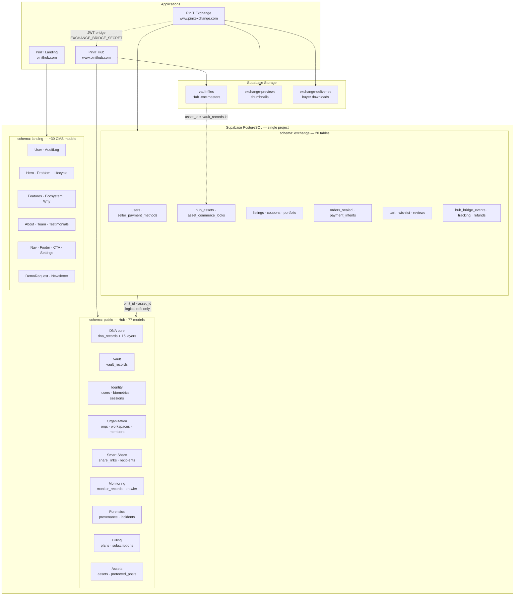
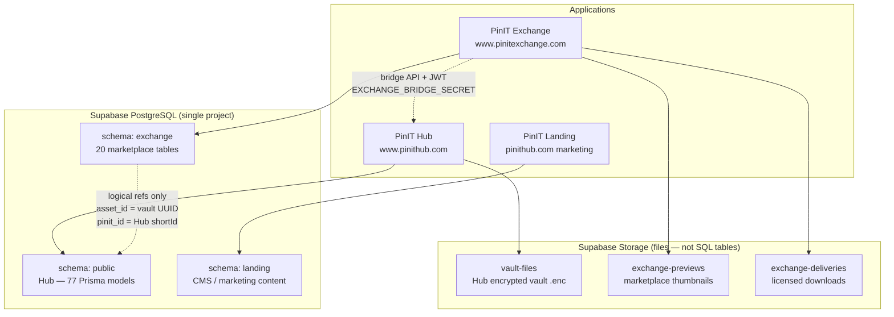
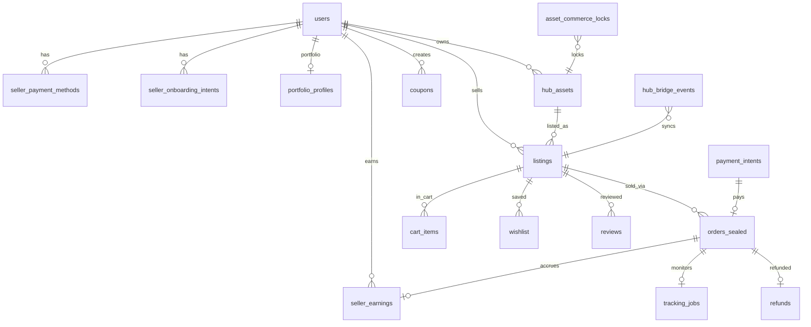
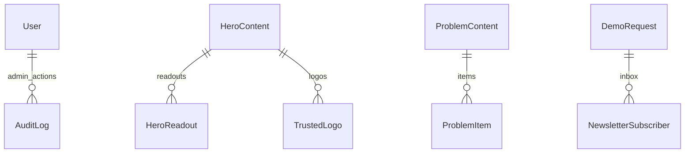
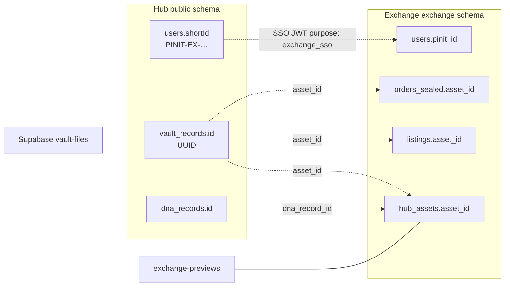

# Database Structure — Pinit Hub, Exchange & Landing

**Document:** Database structure of Pinit Hub (full platform)  
**Scope:** Hub (`public` schema) → Exchange (`exchange` schema) → Landing (`landing` schema) + Supabase Storage  
**Source of truth:** `prisma/schema.prisma`, `exchange/server/schema/exchange.postgres.sql`, `pinithub-landing/prisma/schema.prisma`  
**Last updated:** August 2026

---

## 0. Master platform map (Hub → Exchange → Landing)

---

## 1. Platform topology (one Supabase Postgres project)

### Key rules

| Rule | Detail |
|------|--------|
| **Same Postgres server** | Hub, Exchange, and Landing share one Supabase project |
| **Separate schemas** | `public` (Hub), `exchange` (marketplace), `landing` (CMS) |
| **No cross-schema FKs** | Exchange references Hub by **logical IDs** only (`asset_id`, `pinit_id`) |
| **Vault isolation** | Encrypted masters stay in Hub `vault-files` — never in Exchange DB |

### Connection strings

| App | Schema | Env variable |
|-----|--------|--------------|
| Hub | `public` | `DATABASE_URL`, `DIRECT_URL` (Prisma) |
| Exchange | `exchange` | `EXCHANGE_DATABASE_URL` (or SQLite locally) |
| Landing | `landing` | `DATABASE_URL?schema=landing` (Prisma) |

---

## 2. PinIT Hub — `public` schema (77 models)

**ORM:** Prisma 5  
**Schema file:** `prisma/schema.prisma`  
**Migrations:** `prisma/migrations/` (21 folders)

### 2.1 Core ER diagram (by domain)

```mermaid
erDiagram
  User ||--o{ DnaRecord : owns
  User ||--o| BiometricIdentity : has
  User ||--o| Subscription : has
  User ||--o| Organization : owns
  User ||--o{ ShareLink : creates
  User ||--o{ Asset : protects
  User ||--o{ ProtectedPost : publishes

  DnaRecord ||--|| VaultRecord : vaulted
  DnaRecord ||--|| CryptoLayer : layer1
  DnaRecord ||--|| StructuralLayer : layer2
  DnaRecord ||--|| PerceptualLayer : layer3
  DnaRecord ||--|| SemanticLayer : layer4
  DnaRecord ||--|| MetadataLayer : layer5
  DnaRecord ||--|| StegoLayer : layer6
  DnaRecord ||--o| BehavioralLayer : layer7
  DnaRecord ||--o| RelationshipLayer : layer8
  DnaRecord ||--o| OriginLayer : layer9
  DnaRecord ||--o| EvolutionLayer : layer10
  DnaRecord ||--o| DeepfakeLayer : layer11
  DnaRecord ||--o| DctWatermarkLayer : layer12
  DnaRecord ||--o| CustodyLayer : layer13
  DnaRecord ||--o| ZkProofLayer : layer14
  DnaRecord ||--o| BiometricBindLayer : layer15
  DnaRecord ||--o{ VerificationLog : verifies
  DnaRecord ||--o| LocalFeatureIndex : localDna
  DnaRecord ||--o{ MonitorRecord : monitors
  DnaRecord ||--o{ Certificate : certs
  DnaRecord ||--o{ ForensicProvenanceEvent : provenance
  DnaRecord ||--o{ TrackedExportPackage : tep

  LocalFeatureIndex ||--o{ LocalDnaPatch : patches

  Organization ||--o{ Workspace : has
  Organization ||--o{ Department : has
  Organization ||--o{ OrganizationMember : members
  Organization ||--o{ OrganizationApiKey : keys
  Organization ||--o{ OrganizationWebhook : webhooks

  ShareLink ||--o{ ShareAccessLog : access
  ShareLink ||--o{ ShareRecipient : recipients
  ShareLink ||--o{ UnmaskRequest : unmask

  MonitorRecord ||--o{ CrawlerJob : jobs
  MonitorRecord ||--o{ CrawlerMatch : matches

  Plan ||--o{ Subscription : plans
  Subscription ||--o{ BillingHistory : bills

  Asset ||--o{ AssetTimelineEvent : timeline
  ProtectedPost ||--o{ ProtectedPostTimelineEvent : timeline
```

### 2.2 Hub table inventory (all 77 models)

| Domain | Prisma models | DB table names (`@@map`) |
|--------|---------------|---------------------------|
| **DNA core** | `DnaRecord` + 15 layer models, `VerificationLog`, `OcrRecord`, `DocumentLineage` | `dna_records`, layer tables, `verification_logs`, `ocr_records`, `document_lineage` |
| **Vault** | `VaultRecord` | `vault_records` → files in **`vault-files`** bucket |
| **Identity / auth** | `User`, `BiometricIdentity`, `FaceTemplate`, `VoiceTemplate`, `FingerprintTemplate`, `UserSession`, `UserDevice`, `SecurityEvent`, `LoginHistory`, `RefreshToken` | `users`, `biometric_identities`, template tables, `user_sessions`, etc. |
| **Organization** | `Organization`, `Workspace`, `Department`, `OrganizationMember`, `OrganizationInvite`, `OrganizationAuditLog`, `OrganizationApiKey`, `OrganizationWebhook`, `OrganizationIntegration` | `organizations`, `workspaces`, etc. |
| **Smart share** | `ShareLink`, `ShareViewerMessage`, `ShareRecipient`, `RecipientTrustEvent`, `UnmaskRequest`, `LinkForwardEvent`, `FileTamperEvent`, `RecipientProfile`, `WatermarkProfile`, `ShareAccessLog`, `BlockedShareViewer` | share_* tables |
| **Monitoring / crawler** | `MonitorRecord`, `CrawlResult`, `MonitoringRun`, `MonitoringFailure`, `CrawlerJob`, `CrawlerMatch` | monitor_*, crawler_* tables |
| **Forensics** | `ForensicProvenanceEvent`, `TrackedExportPackage`, `Incident`, `EvidenceRecord`, `AuditEvent` | provenance, TEP, incident tables |
| **Billing** | `Plan`, `Subscription`, `FeatureEntitlement`, `BillingHistory`, `UsageRecord` | plans, subscriptions, etc. |
| **Certificates** | `Certificate` | `certificates` |
| **Publish Guardian** | `ProtectedPost`, `ProtectedPostTimelineEvent`, `ProtectedPostDiscovery`, `ExtensionAuthCode` | protected_post_* tables |
| **Universal assets** | `Asset`, `AssetPlatformLink`, `AssetTimelineEvent`, `AssetDiscovery` | assets, asset_* tables |
| **Platform** | `Notification`, `PlatformEvent` | `notifications`, `platform_events` |
| **Local DNA index** | `LocalFeatureIndex`, `LocalDnaPatch` | `local_feature_indexes`, `local_dna_patches` |

### 2.3 Hub identity & vault keys

| Concept | Column / field | Example |
|---------|------------------|---------|
| **User identity** | `users.shortId` (unique) | `PINIT-EX-M58CDMZU` |
| **Internal user PK** | `users.id` (UUID) | Used for FK scoping |
| **Vault asset ID** | `vault_records.id` (UUID) | Same as Exchange `asset_id` |
| **DNA record ID** | `dna_records.id` (UUID) | Referenced in Exchange `hub_assets.dna_record_id` |
| **Encrypted file path** | `vault_records.encryptedFilePath` | Supabase key `{ownerUserId}/{vaultId}.enc` or local path in dev |

### 2.4 DNA layer models (1:1 with `DnaRecord`)

| Layer | Model | Purpose |
|-------|-------|---------|
| 1 | `CryptoLayer` | SHA-256 hashes |
| 2 | `StructuralLayer` | Sobel edge / structural signature |
| 3 | `PerceptualLayer` | pHash / aHash / dHash |
| 4 | `SemanticLayer` | RGB histogram / dominant colours |
| 5 | `MetadataLayer` | EXIF / IPTC / provenance |
| 6 | `StegoLayer` | LSB steganography + HMAC |
| 7 | `BehavioralLayer` | Behavioral fingerprint |
| 8 | `RelationshipLayer` | Relationship graph |
| 9 | `OriginLayer` | Origin metadata |
| 10 | `EvolutionLayer` | Evolution tracking |
| 11 | `DeepfakeLayer` | Deepfake signals |
| 12 | `DctWatermarkLayer` | DCT watermark |
| 13 | `CustodyLayer` | Chain of custody |
| 14 | `ZkProofLayer` | ZK proof metadata |
| 15 | `BiometricBindLayer` | Biometric bind |

### 2.5 Hub `User` model (key fields)

| Field | Type | Notes |
|-------|------|-------|
| `id` | UUID PK | Internal |
| `shortId` | String unique | Public PINIT ID |
| `email` | String? unique | Optional |
| `fullName` | String | Display name |
| `role` | `UserRole` enum | USER, ADMIN, etc. |
| `accountType` | `AccountType` | INDIVIDUAL / BUSINESS |
| `faceRegistered` | Boolean | Biometric auth |
| `voiceRegistered` | Boolean | Voice auth |
| `webauthnCredentialId` | String? | Device bind |
| `organization` | String? | Legacy org label |

Related: `BiometricIdentity`, `FaceTemplate`, `VoiceTemplate`, `UserSession`, `RefreshToken`.

### 2.6 Hub `VaultRecord` model (key fields)

| Field | Type | Notes |
|-------|------|-------|
| `id` | UUID PK | = Exchange `asset_id` |
| `dnaRecordId` | UUID unique FK | Links to DNA |
| `encryptedFilePath` | String | Supabase path or local |
| `originalFileName` | String | |
| `originalMimeType` | String | |
| `encryptionAlgorithm` | String | AES-256-GCM |
| `ivHex`, `authTagHex` | String | Decryption metadata |

---

## 3. PinIT Exchange — `exchange` schema (20 tables)

**Schema file:** `exchange/server/schema/exchange.postgres.sql`  
**Local dev:** SQLite `exchange/server/exchange.db` (same logical tables)  
**Init:** `exchange/server/database.js` on startup

### 3.1 Exchange ER diagram

### 3.2 Exchange tables (full reference)

#### `exchange.users`

Marketplace profile — **not** Hub auth. Linked by `pinit_id`.

| Column | Type | Default | Notes |
|--------|------|---------|-------|
| `pinit_id` | TEXT PK | — | Hub `shortId` (e.g. `PINIT-EX-…`) |
| `exchange_id` | TEXT UNIQUE | — | `PX-######` commerce ID |
| `name` | TEXT | — | Display name |
| `email` | TEXT UNIQUE | — | From Hub SSO |
| `role` | TEXT | `creator` | `creator` = seller, `buyer` = buyer |
| `kyc_status` | TEXT | `verified` | Informational |
| `biometric_verified` | SMALLINT | 1 | Set on Hub SSO |
| `seller_plan` | TEXT | `pro` | starter / pro / enterprise_pro |
| `bio` | TEXT | — | Storefront bio |
| `hub_linked` | SMALLINT | 0 | 1 after SSO |
| `onboarding_step` | TEXT | `complete` | e.g. `protect_in_hub` |
| `seller_onboarding_status` | TEXT | `SELLER_ACTIVE` | Payment verification gate |
| `razorpay_customer_id` | TEXT | — | Provider ref only |
| `created_at` | TIMESTAMPTZ | NOW() | |

#### `exchange.seller_payment_methods`

Provider token references — **never** card numbers / CVV.

| Column | Type | Notes |
|--------|------|-------|
| `id` | TEXT PK | |
| `pinit_id` | TEXT FK → users | |
| `provider` | TEXT | `razorpay` |
| `provider_customer_id` | TEXT | |
| `provider_method_id` | TEXT UNIQUE | Token ref |
| `provider_payment_id` | TEXT | |
| `status` | TEXT | pending / verified |
| `method_type`, `last4`, `brand` | TEXT | Display only |
| `idempotency_key` | TEXT UNIQUE | |
| `verified_at` | TIMESTAMPTZ | |

#### `exchange.seller_onboarding_intents`

Idempotent seller payment verification sessions.

| Column | Type | Notes |
|--------|------|-------|
| `id` | TEXT PK | |
| `pinit_id` | TEXT | Seller |
| `idempotency_key` | TEXT UNIQUE | |
| `razorpay_order_id` | TEXT | |
| `status` | TEXT | pending / completed |
| `completed_at` | TIMESTAMPTZ | |

#### `exchange.hub_assets`

Marketplace-safe **references** to Hub vault assets (not vault masters).

| Column | Type | Notes |
|--------|------|-------|
| `asset_id` | TEXT PK | = Hub `vault_records.id` |
| `pinit_id` | TEXT | Seller |
| `title`, `file_type`, `vertical` | TEXT | |
| `preview_url` | TEXT | Often `/api/hub/preview/{uuid}` |
| `dna_record_id` | TEXT | Hub DNA UUID |
| `human_percent`, `ai_percent`, `badge_tier` | INT/TEXT | Authenticity badge |
| `protection_status` | TEXT | protected / pending / failed |

#### `exchange.listings`

| Column | Type | Notes |
|--------|------|-------|
| `listing_id` | TEXT PK | e.g. `L-90227` |
| `asset_id` | TEXT | Hub vault UUID |
| `pinit_id` | TEXT | Seller |
| `title`, `description`, `vertical`, `tags` | TEXT | |
| `price_personal` … `price_enterprise` | DOUBLE | Tier pricing |
| `status` | TEXT | draft / published / live / archived / sold_exclusive |
| `badge_tier`, `human_percent`, `ai_percent` | | Trust metadata |
| `dna_hash` | TEXT | Summary hash |
| `tagline`, `protection_error` | TEXT | |

#### `exchange.orders_sealed`

Tamper-proof sale ledger.

| Column | Type | Notes |
|--------|------|-------|
| `seal_id` | TEXT PK | |
| `order_id` | TEXT UNIQUE | |
| `listing_id`, `asset_id` | TEXT | |
| `seller_pinit_id`, `seller_exchange_id` | TEXT | |
| `buyer_pinit_id`, `buyer_name`, `buyer_email` | TEXT | |
| `license_tier`, `price_paid`, `platform_fee`, `creator_net` | | |
| `dna_hash_summary` | TEXT | |
| `payment_status`, `razorpay_order_id`, `razorpay_payment_id` | TEXT | |
| `license_status`, `delivery_status` | TEXT | |
| `delivery_url`, `delivery_token` | TEXT | |

#### Other Exchange tables

| Table | Purpose |
|-------|---------|
| `requirements` | Buyer briefs / RFPs |
| `tracking_jobs` | Post-sale monitoring refs |
| `cart_items` | Buyer cart (by `buyer_key`) |
| `wishlist` | Saved listings |
| `reviews` | Listing reviews |
| `coupons` | Seller promo codes |
| `payment_intents` | Razorpay checkout intents (buyers) |
| `asset_commerce_locks` | Exclusive-sale locks |
| `hub_bridge_events` | Async Hub↔Exchange bridge queue |
| `refunds` | Refund records |
| `seller_earnings` | Accrued seller revenue (`status: accrued`) |
| `portfolio_profiles` | Public creator portfolios (`/p/:slug`) |

---

## 4. PinIT Landing — `landing` schema (CMS)

**Schema file:** `pinithub-landing/prisma/schema.prisma`  
**Purpose:** Marketing site content editable from `/admin` — **no link** to Hub users or Exchange sellers.

### 4.1 Landing ER diagram (simplified)

### 4.2 Landing tables (grouped)

| Group | Models |
|-------|--------|
| **Admin access** | `User`, `AuditLog` |
| **Section chrome** | `SectionMeta` |
| **Hero** | `HeroContent`, `HeroReadout`, `TrustedLogo` |
| **Problem** | `ProblemContent`, `ProblemItem` |
| **Lifecycle** | `LifecycleStage` |
| **Capabilities** | `Feature` |
| **Ecosystem** | `EcosystemProduct` |
| **Why PINITHUB** | `WhyCard` |
| **Choose us** | `ChooseUsReason` |
| **Industries** | `Industry` |
| **About** | `AboutContent`, `AboutPillar`, `Stat`, `TeamMember` |
| **Proof** | `Testimonial`, `FaqItem` |
| **CTA / site chrome** | `CtaContent`, `SiteSettings`, `NavLink`, `FooterLink`, `SocialLink` |
| **Inbox** | `DemoRequest`, `NewsletterSubscriber` |

**Connection:** `DATABASE_URL` with `?schema=landing` on the shared Supabase project.

---

## 5. Cross-system logical links (Hub ↔ Exchange)

| Link | Hub | Exchange | Mechanism |
|------|-----|----------|-----------|
| **Identity** | `users.shortId` | `users.pinit_id` | Hub signs JWT → `POST /api/auth/hub-sso` |
| **Asset** | `vault_records.id` | `hub_assets.asset_id`, `listings.asset_id` | Bridge API; vault bytes stay in Hub |
| **DNA** | `dna_records.id` | `hub_assets.dna_record_id` | Summary copied at list time |
| **Preview** | Vault decrypt (Hub API) | `GET /api/hub/preview/:assetId` | Exchange proxies with `EXCHANGE_BRIDGE_SECRET` |
| **List confirm** | Hub bridge | `hub_bridge_events` | Async confirm / seal callbacks |
| **Delivery** | Hub vault | `orders_sealed.delivery_*` | Short-lived delivery tokens |

### Bridge environment variables

| Variable | Service | Purpose |
|----------|---------|---------|
| `EXCHANGE_BRIDGE_SECRET` | Hub + Exchange Render | JWT sign/verify for SSO and bridge |
| `HUB_API_URL` | Exchange | Hub API base (e.g. `…/api/v1`) |
| `HUB_APP_URL` / `VITE_HUB_APP_URL` | Exchange frontend | Hub UI for SSO redirect |

---

## 6. Supabase Storage (not SQL)

| Bucket | Owner | Path convention | Access |
|--------|-------|-----------------|--------|
| `vault-files` | **Hub** | `{ownerUserId}/{vaultId}.enc` | Private; Hub service key |
| `exchange-previews` | **Exchange** | `sellers/{pinitId}/{assetId}.*` | Public read for marketplace previews |
| `exchange-deliveries` | **Exchange** | Licensed delivery objects | Private; signed URLs only |

**Rule:** Exchange policies must **never** grant access to `vault-files`.

---

## 7. Schema counts summary

| Layer | Postgres schema | Tables | ORM / access |
|-------|-----------------|--------|--------------|
| **PinIT Hub** | `public` | 77 | Prisma |
| **PinIT Exchange** | `exchange` | 20 | Raw SQL / sqlite adapter |
| **PinIT Landing** | `landing` | ~30 | Prisma |
| **Storage** | Supabase buckets | 3 | Supabase Storage API |

---

## 8. Seller onboarding states (Exchange)

| Status | Meaning |
|--------|---------|
| `SELLER_ACTIVE` | Can list and sell (existing sellers grandfathered here) |
| `PAYMENT_METHOD_REQUIRED` | New seller — must verify payment method |
| `PAYMENT_METHOD_PENDING` | Razorpay checkout in progress |
| `PAYMENT_METHOD_FAILED` | Verification failed — retry allowed |
| `PAYMENT_METHOD_VERIFIED` | Payment method stored — treated as active |

---

## 9. Related documentation

| Document | Path |
|----------|------|
| Hub DB architecture (detailed) | `docs/architecture/06_Database_Architecture.md` |
| Hub Prisma schema | `prisma/schema.prisma` |
| Exchange Postgres DDL | `exchange/server/schema/exchange.postgres.sql` |
| Exchange storage buckets | `exchange/server/schema/exchange.storage.sql` |
| Landing CMS schema | `pinithub-landing/prisma/schema.prisma` |
| Project overview | `docs/architecture/01_Project_Overview.md` |

---

## 10. Production URLs (reference)

| Service | URL |
|---------|-----|
| Hub UI | https://www.pinithub.com |
| Exchange UI | https://www.pinitexchange.com |
| Hub API | https://pinit-dna-uf5y.onrender.com/api/v1 |
| Exchange API | https://pinit-dna-3fmw.onrender.com |

---

*End of document — Database Structure of Pinit Hub (full platform)*
