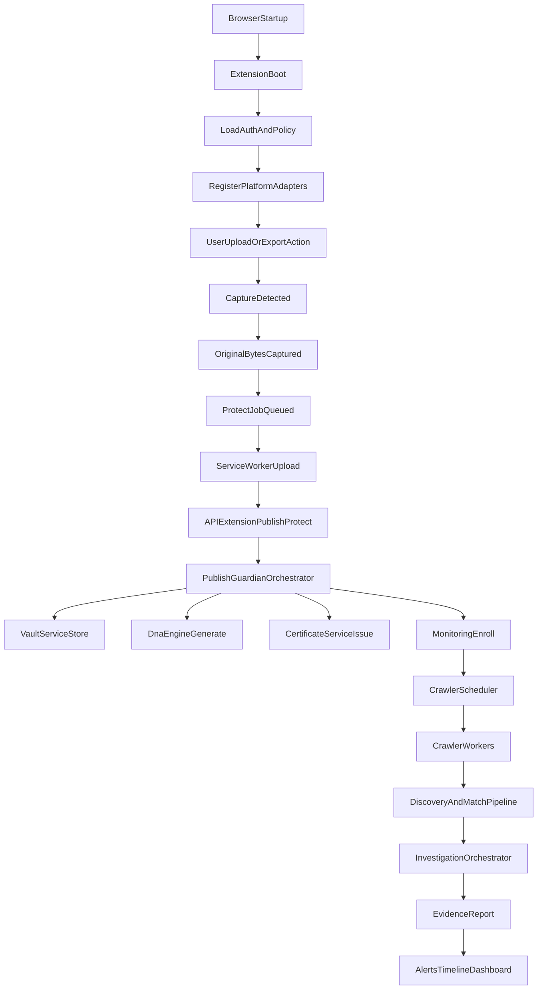
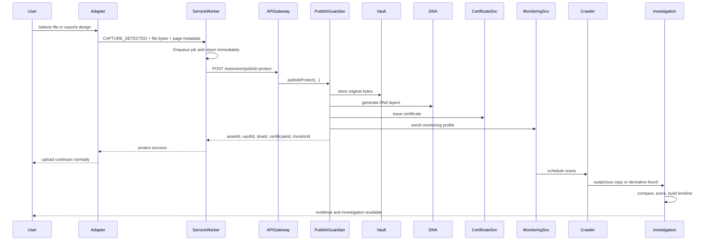
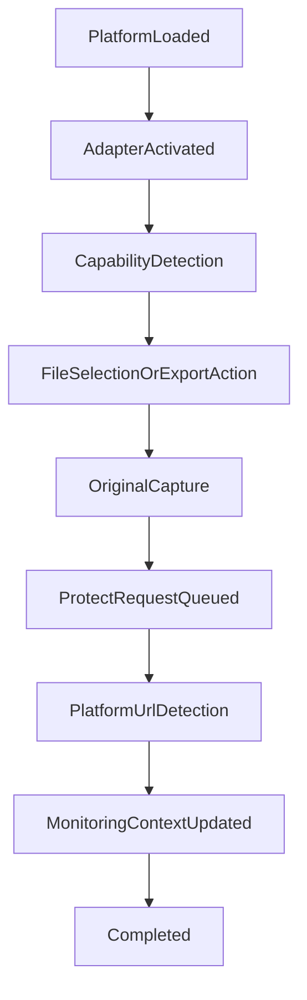
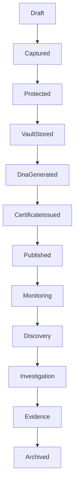
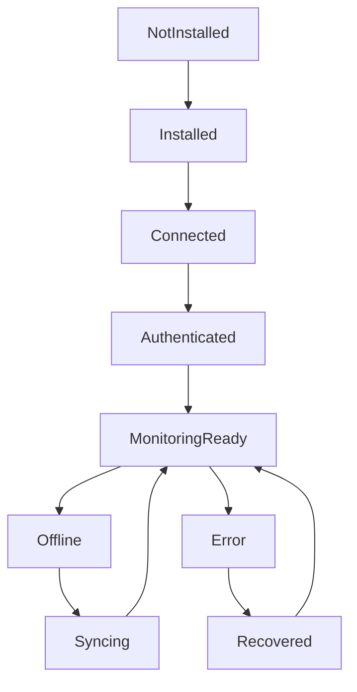

# PinIT Extension Ecosystem Architecture

## 1. Vision

PinIT should become an intelligent protection layer between a creator's workflow and the public internet. Its job is not to mirror cloud storage, scrape websites, or harvest arbitrary content. Its job is to protect user-owned original assets at the moments when those assets are intentionally uploaded, exported, or published.

The extension ecosystem must support this core promise:

1. The authenticated user selects, exports, or publishes an original asset.
2. PinIT captures the original bytes before platform transformation.
3. PinIT stores the authoritative original in Vault.
4. PinIT generates DNA and issues an ownership certificate.
5. PinIT starts monitoring public surfaces for republication, tampering, and lineage evidence.
6. PinIT produces investigation-grade evidence when suspicious copies are found.

This architecture must stay technically honest. Browser extensions cannot observe everything. PinIT should overperform on what is possible and be explicit about what is not.

## 2. Product Scope

### In scope

- Protect-before-publish for supported browser upload flows.
- Protect-before-export for supported browser-based creation tools.
- Manual protect via context menu or explicit user action.
- Late binding of public platform URLs when they appear after capture.
- Monitoring of public internet surfaces for republication and derivative copies.
- DNA matching, tamper analysis, certificate verification, and evidence generation.
- Tenant-safe, auditable workflows for individuals and enterprises.

### Out of scope

- Capturing arbitrary website images during browsing.
- Monitoring private chats, private DMs, or private cloud storage activity.
- Reading local files outside explicitly user-triggered browser actions.
- Acting like a cloud drive that syncs all user content.
- Claiming exact viewer telemetry from third-party platforms that do not expose it.

## 3. Operating Principles

### Positive principles

- Event-first, not content-scrape-first.
- Protect originals, not downloaded derivatives.
- Default to asynchronous protection so the user's upload or export continues.
- Preserve chain of custody with append-only events.
- Keep detection confidence explicit: confirmed, inferred, externally linked, or impossible to observe.
- Separate capture from monitoring. The extension starts protection; the backend and crawler own discovery.

### Anti-goals

- Do not scrape feeds.
- Do not auto-protect images simply because they are visible on a page.
- Do not infer ownership from browsing behavior alone.
- Do not promise real-time tracking on platforms that do not provide events.

## 4. Current-State Baseline

The current codebase already contains the foundation of this architecture, though not yet at full enterprise maturity.

### Extension baseline

Current extension entry points:

- `extension/manifest.json`
- `extension/background/service-worker.js`
- `extension/shared/adapter-interface.js`
- `extension/shared/queue.js`
- `extension/shared/api.js`
- `extension/content/export-protect.js`
- `extension/content/adapters/*.js`
- `extension/popup/popup.js`
- `extension/options/options.js`

Today the extension is a Manifest V3 model with:

- a background service worker as coordinator,
- content scripts for upload/export capture,
- per-platform adapters,
- popup and options surfaces,
- `chrome.storage.local` for config, auth, queue, and last-run status,
- queue-first upload protection with retry/backoff.

### Backend baseline

Current extension-facing backend entry points:

- `src/api/routes/publish-guardian.routes.ts`
- `src/api/controllers/publish-guardian.controller.ts`
- `src/services/publish-guardian/publish-guardian.service.ts`

Current protection primitives:

- `src/services/vault/vault.service.ts`
- `src/services/dna.orchestrator.ts`
- `src/services/certificates/certificate.service.ts`
- `src/services/crawler/monitoring.service.ts`
- `src/services/crawler/engine/crawler-engine.service.ts`
- `src/services/forensics/unified-investigation.orchestrator.ts`

The backend already supports:

- extension auth-code exchange,
- `publish-protect`,
- `register-post`,
- extension sync,
- DNA, vault, certificate, monitoring, and forensic investigation services,
- idempotent recovery using `clientRequestId`,
- append-only forensic provenance and aggregate-specific timelines.

### Data baseline

Current authoritative and additive aggregates in `prisma/schema.prisma` include:

- `DnaRecord`
- `VaultRecord`
- `Certificate`
- `MonitorRecord`
- `ForensicProvenanceEvent`
- `ProtectedPost`
- `ProtectedPostTimelineEvent`
- `ProtectedPostDiscovery`
- `Asset`
- `AssetTimelineEvent`
- `AssetDiscovery`
- `PlatformEvent`
- `AuditEvent`
- `ExtensionAuthCode`
- `Incident`
- `EvidenceRecord`

This means PinIT already has strong primitives for identity, encrypted storage, monitoring, provenance, evidence, and extension-bound protection flows.

## 5. User Journeys

### 5.1 Protect Before Publish

1. User signs into the PinIT extension.
2. User navigates to a supported platform upload or publish flow.
3. User selects or drags an original file.
4. PinIT adapter captures the original `File` or exported blob before platform transformation.
5. Extension enqueues a protect job immediately.
6. Background worker uploads the file and metadata to the backend asynchronously.
7. Backend stores the original in Vault, generates DNA, issues a certificate, and enrolls monitoring.
8. User's upload to the third-party platform continues without waiting for forensic work.
9. When the public post URL becomes available, PinIT links it to the protected asset.

### 5.2 Protect Before Export

1. User works in a browser-native creative tool such as Canva, Figma, or Adobe Express.
2. User clicks export or download.
3. PinIT captures the export artifact as the authoritative original for that export event.
4. Protection runs in parallel with the export.
5. Vault, DNA, certificate, and monitoring records are created.

### 5.3 Manual Protect

1. User intentionally right-clicks a user-owned asset or invokes a PinIT command.
2. Extension protects the selected source only.
3. Asset enters the same protection pipeline as publish/export captures, but without implying platform publication.

### 5.4 Folder Watch (future)

1. User explicitly enrolls one or more local folders.
2. A desktop companion, not the browser extension alone, watches those folders.
3. When a watched file is exported or created, PinIT protects it locally or through a secure companion API.

Folder watch is not a pure browser-extension feature and should be modeled as a later endpoint-integrated product surface.

## 6. Browser Extension Architecture

### Components

- Manifest V3 shell
- Background service worker
- Platform-specific content scripts
- Shared adapter runtime
- Popup
- Options page
- Context menus
- Optional future side panel
- Message bus
- Local queue and retry layer
- Local state/config/auth storage
- Telemetry and health logging

### Runtime responsibilities

#### Service worker

Responsible for:

- auth and token refresh,
- queue orchestration,
- routing `PUBLISH_CAPTURE` and related messages,
- badge/status updates,
- extension sync,
- manual protect and verify actions.

#### Content scripts

Responsible for:

- detecting upload or export actions,
- capturing original bytes when possible,
- extracting page and platform context,
- forwarding events to the service worker,
- never inspecting unrelated page media just because it exists in the DOM.

#### Popup and side panel

Responsible for:

- auth state,
- queue status,
- recent protection events,
- asset lookup shortcuts,
- organization policy visibility,
- investigation shortcuts.

### Recommended browser subsystem design

#### Message bus

Standardize these internal commands:

- `AUTH_CONNECT_START`
- `AUTH_CONNECT_COMPLETE`
- `CAPTURE_DETECTED`
- `CAPTURE_BYTES_READY`
- `PROTECT_ENQUEUE`
- `PROTECT_UPLOAD_START`
- `PROTECT_UPLOAD_SUCCESS`
- `PROTECT_UPLOAD_FAILURE`
- `POST_URL_DISCOVERED`
- `SYNC_STATE`
- `SHOW_ALERT`

#### Local storage domains

- `authStore`
- `configStore`
- `queueStore`
- `telemetryStore`
- `recentActivityStore`
- `policyStore`

#### Queue types

- Upload queue
- Retry queue
- Offline queue
- Late-link queue for post/public URL binding
- Telemetry buffer queue

## 7. Platform Adapter Architecture

PinIT should support unlimited adapters through a registry model.

### Adapter contract

Every adapter should declare:

- `platformId`
- `displayName`
- `captureModes`
- `requiresOfficialApi`
- `supportsFileInput`
- `supportsDragDrop`
- `supportsExportHook`
- `supportsLateUrlBinding`
- `supportsMultiFile`
- `confidenceLevel`
- `termsRiskLevel`

### Adapter classes

#### Class A: event-native upload adapters

Examples:

- Instagram Web
- Facebook
- LinkedIn
- Pinterest
- YouTube Studio
- GitHub Releases
- Shopify
- WordPress

Detection source:

- `<input type="file">`
- drag/drop
- platform upload widgets

#### Class B: export adapters

Examples:

- Canva
- Figma
- Adobe Express
- Google Docs export
- Microsoft 365 export

Detection source:

- explicit export actions,
- generated blob URLs,
- export/download events,
- official integration APIs when available.

#### Class C: official API-assisted adapters

Examples:

- Google Drive
- Dropbox
- OneDrive
- Slack
- Discord

These should be modeled as hybrid flows where the browser event triggers protection intent, but final linking, document metadata, or team ownership resolution may require OAuth and platform APIs.

#### Class D: manual protect adapters

Used when automatic capture is not sufficiently trustworthy.

### Adapter hard rules

- Adapters detect user action, not visual content.
- Adapters may inspect upload widgets, not scrape full feeds.
- Adapters must never auto-protect files loaded from third-party pages unless the user initiated upload/export/protect.
- Adapters must annotate confidence and capture method for every event.

## 8. Capture Pipeline

### Goal

Capture the original bytes before the third-party platform transforms the file.

### Pipeline stages

1. Detect publish/export intent.
2. Validate that the event is user-initiated.
3. Capture the authoritative file object, export blob, or generated binary.
4. Compute local lightweight metadata:
   - filename
   - MIME type
   - size
   - local SHA-256 if feasible
   - platform
   - page URL
   - profile/channel/page hints
   - capture mode
5. Enqueue asynchronously.
6. Return control immediately to the website.
7. Upload to PinIT backend in the background.

### Ownership gating

The extension must treat ownership in three levels:

- `confirmed_owner_context`: authenticated user selected or exported the file.
- `probable_owner_context`: authenticated user initiated a protect command for visible content.
- `unconfirmed_context`: page contains media but no protect-worthy action occurred.

Only the first two can proceed. The third must never generate a protection job.

### Deduplication

Before uploading, the extension can compute a lightweight local fingerprint to avoid replaying the same file within a short session. This dedupe is advisory; the backend remains authoritative via `clientRequestId` and content hash checks.

## 9. Protection Pipeline

Once the backend receives a protection request, the pipeline should operate as a composed orchestration service:

1. Authenticate extension session.
2. Validate tenant and policy.
3. Create a draft asset/protected-post record.
4. Generate authoritative content hash.
5. Run duplicate or prior-ownership checks.
6. Store original in Vault.
7. Generate DNA layers.
8. Issue ownership certificate.
9. Create or attach monitoring profile.
10. Write chain-of-custody and timeline events.
11. Return IDs and status to extension.

### Core services

- API Gateway
- Extension Auth Service
- Publish Guardian Orchestrator
- Vault Service
- DNA Engine
- Certificate Service
- Monitoring Enrollment Service
- Timeline/Provenance Service
- Notification Service

## 10. Upload Flow: Browser Startup To Investigation

### Detailed runtime sequence

## 11. Platform URL Linking

PinIT must distinguish between two URLs:

- `originalUploadUrl`: the page where the user uploaded or exported the original
- `platformUrl`: the final public URL of the resulting post, asset, release, page, or document

### Why this matters

At capture time, the final public URL often does not yet exist. For example:

- YouTube video URL appears after processing or draft creation
- Instagram permalink appears after publish
- LinkedIn post URL appears after confirmation
- GitHub release URL appears after publish

### URL lifecycle model

1. Capture initial browser page URL.
2. Create Asset and ProtectedPost with `originalUploadUrl`.
3. Store provisional linkage status as `PENDING_PUBLIC_URL`.
4. Use adapter observer, official callback, or background poll to bind final public `platformUrl`.
5. Update monitoring profile with final public URL, profile/channel URL, and post ID.

### Recommended linked fields

- Platform
- Platform URL
- Original Upload URL
- Profile URL
- Post ID
- Platform User
- Channel/Page/Profile
- First Seen
- Last Seen
- URL State

## 12. Monitoring Pipeline

### Monitoring responsibilities

- maintain watch lists,
- schedule scans,
- dedupe target URLs,
- classify crawl scope,
- trigger discovery analysis,
- update risk state,
- generate alerts and evidence.

### Monitoring sources

- public websites,
- public search engines,
- GitHub,
- social platforms with public web visibility,
- CDNs and file hosts,
- public buckets,
- blogs, forums, and news sites.

### Monitoring does not include

- private DMs,
- closed chat groups,
- WhatsApp private shares,
- private cloud docs without API grants,
- local device views.

## 13. Crawler Architecture

### Services

- Scheduler
- Frontier manager
- Connector workers
- Content fetchers
- Media normalizers
- DNA matcher
- Similarity scorer
- Tamper analyzer
- Discovery writer
- Alert dispatcher

### Connector types

- Search engine connectors
- Public social connectors
- GitHub connector
- Public CMS/blog connectors
- CDN/object storage connectors
- Reverse image/video search adapters

### Worker model

- DB-backed or broker-backed job queue
- per-platform connector pools
- retry policy with exponential backoff
- rate-limit aware execution
- dead-letter queues for toxic jobs

## 14. Discovery Pipeline

1. Crawler finds candidate URL.
2. Candidate content is normalized.
3. Matching engine compares candidate against authoritative PinIT assets.
4. Discovery event is created with confidence, match type, and severity.
5. If thresholds are met, tamper analysis and investigation begin.
6. Timeline, alerts, and evidence are updated.

### Discovery result types

- exact match
- near match
- transformed derivative
- screenshot-derived copy
- likely AI-edited derivative
- non-match

## 15. DNA Matching Pipeline

### Matching layers

- exact cryptographic hash
- normalized hash
- perceptual hash
- local patch signatures
- semantic embeddings
- watermark extraction
- structural analysis
- metadata correlation

### Match confidence classes

- `CONFIRMED_IDENTICAL`
- `CONFIRMED_DERIVED`
- `LIKELY_DERIVED`
- `WEAK_SIMILARITY`
- `NO_MATCH`

### Tamper signals

- metadata removed
- watermark partially removed
- compression artifacts
- crop
- resize
- screenshot reproduction
- AI retouch/edit signatures
- frame extraction or transcoding in video flows

## 16. Investigation Pipeline

When a suspicious file is uploaded or discovered:

1. Resolve candidate asset(s).
2. Retrieve authoritative original from Vault.
3. Compare candidate against original and stored DNA.
4. Evaluate tampering and derivative evidence.
5. Build timeline and provenance narrative.
6. Compute confidence and risk score.
7. Generate investigation artifact.

### Investigation output

- Owner
- Asset ID
- Vault entry
- DNA comparison
- Similarity score
- tamper findings
- chain of custody
- discovery history
- confidence level
- evidence bundle

## 17. Evidence Generation

### Evidence package contents

- case ID
- asset metadata
- certificate metadata
- authoritative hashes
- discovery URL set
- comparison outputs
- screenshots and fetch timestamps
- timeline events
- confidence and severity
- signed manifest

### Tamper-proofing

- evidence manifest should be signed,
- source artifacts should be content-addressed,
- timeline events should be append-only,
- regenerated views should never mutate underlying evidence.

## 18. Tracking Capabilities

### 18.1 Technically possible with browser extensions

- Detect user file selection on supported upload widgets.
- Detect user drag/drop uploads on supported pages.
- Detect user export/download actions in some browser-native editors.
- Capture original file bytes when the browser exposes the `File` or blob.
- Associate capture with active page URL and known platform context.
- Queue protection offline and sync later.
- Link to a later public platform URL when it becomes visible in page state.

### 18.2 Possible only with official APIs or OAuth

- Resolving exact account/channel/page identity for some enterprise platforms.
- Reading private document metadata from Google Drive, Dropbox, OneDrive, Slack, Notion, or Microsoft 365.
- Confirming final publication metadata when the public web URL is not exposed in the browser UI.
- Mapping a browser-captured upload to internal object IDs in platform backends.
- Enterprise team attribution, tenant policy sync, or content lifecycle hooks in SaaS ecosystems.

### 18.3 Impossible or not defensibly available

- Viewing private DMs in WhatsApp, Telegram, Slack private channels, or Instagram private shares without official server-side participation.
- Tracking arbitrary local opens of files in Adobe Reader, Gallery apps, Finder, Explorer, or OS-native viewers.
- Obtaining viewer GPS, IP, or device identity from third-party platforms unless those platforms expose it to PinIT.
- Knowing private reshare counts, download counts, or view counts from Instagram, Facebook, or YouTube without official APIs and permissions.
- Deleting a downloaded plain file from another user's device.

## 19. Technical Limitations And Reasons

### Private messaging platforms

Unavailable because browser extensions cannot inspect encrypted traffic or application data in native/mobile apps. Even on the web, private content is controlled by the platform and user permissions.

### OS-local file opens

Unavailable because browser extensions operate inside the browser sandbox. They do not get global file-open events from Windows, macOS, Android, or iOS.

### Third-party analytics

Unavailable because view counts, download counts, IPs, and GPS belong to the platform operator, not the extension.

### Post-publication latency

Expected because many platforms generate public URLs only after the upload or publishing transaction completes.

### Export interception variability

Partially available because browser-native editors differ widely in how they construct downloads: some expose file blobs, others use workers, streaming responses, or opaque URLs.

## 20. Database Schema Blueprint

The current schema is strong, but the enterprise target should formalize the following authoritative aggregates.

### Core authoritative tables

- `Asset`
- `AssetVersion`
- `VaultFile`
- `DnaRecord`
- `Certificate`
- `PlatformLink`
- `MonitoringProfile`
- `Discovery`
- `Investigation`
- `EvidenceBundle`
- `Alert`
- `TimelineEvent`
- `CrawlerJob`
- `ActivityLog`

### Recommended responsibilities

#### Asset

Canonical business object for the protected original.

Fields:

- Asset ID
- Owner ID
- Tenant ID
- Workspace/organization scope
- Original filename
- MIME type
- file size
- canonical content hash
- DNA record ID
- vault ID
- certificate ID
- current status
- risk level
- monitoring status
- created/protected timestamps
- capture method

#### PlatformLink

One asset can map to multiple platform presences.

Fields:

- Platform
- Platform user
- Profile/channel/page
- Original upload URL
- Platform URL
- Public URL state
- Post ID
- first seen
- last seen
- monitoring profile ID

#### Discovery

Fields:

- discovery ID
- asset ID
- platform
- URL
- first seen
- last seen
- similarity
- tamper flags
- confidence
- severity
- alert status
- evidence ID
- investigation ID

#### Investigation

Fields:

- investigation ID
- asset ID
- trigger type
- status
- finding summary
- analyst/system actor
- confidence
- resolution
- opened/closed timestamps

#### TimelineEvent

Single enterprise timeline abstraction across all modules.

Fields:

- event ID
- asset ID
- related vault/dna/certificate/platform/discovery/investigation IDs
- event type
- evidence grade
- actor
- timestamp
- structured payload
- immutable hash chain reference

## 21. API Design

### Extension APIs

- `POST /api/v1/auth/extension/issue-code`
- `POST /api/v1/auth/extension/token`
- `POST /api/v1/extension/publish-protect`
- `POST /api/v1/extension/register-post`
- `POST /api/v1/extension/register-export`
- `POST /api/v1/extension/link-platform-url`
- `GET /api/v1/extension/sync`
- `POST /api/v1/extension/heartbeat`
- `POST /api/v1/extension/telemetry/batch`

### Asset APIs

- `GET /api/v1/assets`
- `GET /api/v1/assets/:id`
- `GET /api/v1/assets/:id/timeline`
- `GET /api/v1/assets/:id/discoveries`
- `GET /api/v1/assets/:id/evidence`
- `POST /api/v1/assets/:id/manual-protect-link`

### Monitoring APIs

- `POST /api/v1/monitoring/profiles`
- `PATCH /api/v1/monitoring/profiles/:id`
- `GET /api/v1/monitoring/profiles/:id`
- `POST /api/v1/monitoring/profiles/:id/rescan`

### Investigation APIs

- `POST /api/v1/investigations`
- `GET /api/v1/investigations/:id`
- `POST /api/v1/investigations/:id/compare`
- `POST /api/v1/investigations/:id/evidence/finalize`

### Admin and policy APIs

- `GET /api/v1/org/policies/extension`
- `POST /api/v1/org/policies/extension`
- `GET /api/v1/org/audit/extension-events`

## 22. Browser Permissions Model

### Required baseline permissions

- `storage`
- `alarms`
- `contextMenus`
- `activeTab`
- `scripting`

### Host permissions strategy

Use narrowly targeted host permissions for supported domains where practical, and reserve broad host access only when there is a clear product need and user trust justification.

### Permissions PinIT should avoid unless justified

- unrestricted persistent background capabilities beyond MV3 patterns,
- blanket content reading without event-bound capture,
- native messaging unless folder-watch or desktop companion is introduced.

## 23. Security Model

### Cryptography

- AES-256 or AES-256-GCM for vault encryption.
- Per-asset key derivation and key wrapping.
- Signed ownership certificates.
- Signed evidence manifests.

### Identity and access

- JWT-based user auth for extension.
- extension-bound auth codes for connect flow.
- RBAC for enterprise admin actions.
- strict tenant isolation by owner and organization scope.

### Auditability

- append-only provenance,
- immutable or hash-chained timeline records,
- forensic-safe evidence packaging,
- administrative audit logs for policy changes and investigator actions.

### Privacy

- never fabricate geolocation,
- never claim hidden access to private platform data,
- minimize telemetry to what is necessary for protection and security.

## 24. Scalability Plan

### Design target

- millions of users,
- billions of protected assets,
- long-running monitoring profiles,
- horizontally scaled crawler and investigation workers.

### Scaling strategy

- stateless API layer,
- object storage for authoritative originals and evidence artifacts,
- distributed job queues,
- connector-specific crawler workers,
- vector search and fingerprint indexes for similarity workloads,
- read-optimized projections for dashboard queries,
- partitioning or sharding by tenant, asset family, or time for high-volume event tables.

## 25. Failure Recovery

### Browser-side recovery

- queue-first capture,
- offline persistence,
- retry with exponential backoff,
- idempotent replay,
- recover after service worker restart.

### Backend recovery

- draft rows for in-flight protection,
- idempotent `clientRequestId`,
- resumable monitoring enrollment,
- dead-letter queues for failed crawl jobs,
- retryable late URL registration.

### Degraded modes

- if backend is down, preserve local queue and do not block user upload,
- if monitoring enrollment fails, asset remains protected but marked degraded,
- if final public URL is unknown, monitoring starts from profile/upload context and upgrades later.

## 26. Retry Mechanism

### Extension retries

- immediate enqueue,
- retry after transient network failure,
- bounded attempt count,
- jittered exponential backoff,
- visibility in popup or side panel.

### Backend retries

- queue-based retries for crawler and enrichment jobs,
- idempotent upserts for platform link registration,
- certificate and evidence issuance retries only where replay is safe.

## 27. Offline Queue

The offline queue is a first-class enterprise reliability component, not just a temporary buffer.

### Queue requirements

- durable across browser restarts,
- dedupe by client request ID,
- ordered by capture time,
- visible to the user,
- policy-aware,
- exportable for diagnostics in enterprise deployments.

## 28. User Experience

### UX principles

- invisible during happy path,
- transparent when protection occurs,
- never blocks publish unless policy demands it,
- clear when protection is pending or degraded,
- easy access to asset, certificate, and monitoring status,
- no noisy prompts during normal browsing.

### UX surfaces

- popup for quick state and queue view,
- side panel for richer asset and investigation context,
- in-page discreet notifications only after actual capture,
- admin policy hints for managed enterprise tenants.

## 29. Future Roadmap

### Phase 1

- Reliable upload capture for core browser platforms.
- Asset-first data model standardization.
- Late public URL binding.
- Side-panel visibility.

### Phase 2

- Stronger export capture for browser-native editors.
- Official API connectors for enterprise SaaS platforms.
- Unified timeline and alert models.

### Phase 3

- Desktop companion for folder watch and local export workflows.
- Policy management for enterprises.
- Deeper chain-of-custody and signed evidence packaging.

### Phase 4

- Endpoint-integrated enterprise deployment,
- advanced video DNA,
- automated legal/evidence workflows,
- high-scale investigator console.

## 30. Risks And Mitigations

### Risk: adapter fragility

Mitigation:

- adapter registry,
- capability descriptors,
- telemetry for breakage detection,
- contract tests per adapter,
- fallback to manual protect.

### Risk: overcollection or privacy violation

Mitigation:

- event-first detection,
- strict anti-goals,
- minimized permissions,
- explicit ownership gating,
- auditable capture events.

### Risk: unsupported platform claims

Mitigation:

- publish a capability matrix,
- classify every feature as confirmed, API-dependent, inferred, or impossible,
- avoid marketing claims that exceed browser or platform constraints.

### Risk: queue loss or partial protection

Mitigation:

- durable local queue,
- idempotent backend orchestration,
- visible status,
- draft and replay-safe server flows.

### Risk: evidence credibility

Mitigation:

- signed manifests,
- append-only provenance,
- separation of original evidence from derived views,
- confidence labeling and source traceability.

## 31. Capability Boundary Summary

### Available

- Capture original files from browser upload or export actions when the browser exposes the bytes.
- Protect and monitor those files asynchronously.
- Link assets to later public URLs.
- Detect public republication and many transformed derivatives.
- Build investigation artifacts from authoritative originals, DNA, vault, certificate, discovery, and timeline data.

### Available only with official platform APIs or OAuth

- Deep account mapping for managed business platforms.
- Some final URL, object ID, or team-workspace metadata.
- Certain SaaS-private document or export workflows.

### Not available

- Private DM flows,
- local file opens outside the browser,
- third-party platform private analytics without access grants,
- guaranteed identity of every downstream viewer,
- deletion of plain downloaded copies from external devices.

## 32. Recommended Positioning

The strongest defensible product claim is:

> PinIT protects original user-owned digital assets at the moment of upload, export, or publication, stores the authoritative original in Vault, generates persistent DNA and ownership proof, and continuously reconstructs public lifecycle evidence wherever the asset can be observed again.

That claim is strong, technically honest, privacy-respecting, and aligned with browser security models and real platform constraints.

## 33. Platform Capability Matrix

This section defines what each major adapter is expected to do in the real world. The goal is to give engineering, QA, and product a concrete target per platform rather than a generic "supports uploads" label.

### Capability legend

- `Yes`: expected to work in the browser without official API help
- `Partial`: possible, but conditional on DOM shape, export method, or page mode
- `OAuth/API`: requires official platform APIs, OAuth, or enterprise integration
- `No`: not technically available or not acceptable for privacy/product reasons

| Platform | Upload Detection | Drag & Drop | Export Capture | Public URL Detection | Post Type Coverage | Platform User Resolution | Expected Notes |
|---|---|---|---|---|---|---|---|
| Instagram Web | Yes | Partial | No | Partial | Post, Reel, limited Story awareness | Partial | Permalink often appears after publish |
| YouTube Studio | Yes | Yes | No | Partial | Video upload, draft, channel assets | Partial | Final watch URL may arrive after processing |
| Canva | Partial | Partial | Yes | No | Exported design artifacts | Partial | Export capture is primary flow, not public URL linking |
| Figma | Partial | Partial | Yes | No | Exported frames/assets | OAuth/API | Team/workspace metadata may require API |
| Facebook | Yes | Partial | No | Partial | Post/media publish | Partial | Public URL quality varies by page/profile mode |
| LinkedIn | Yes | Partial | No | Partial | Post/media article flows | Partial | Post URL may appear only after confirmation |
| GitHub | Yes | Partial | No | Yes | Releases, issue/comment attachments, repo uploads | OAuth/API | Repo metadata benefits from API |
| Shopify | Yes | Partial | No | OAuth/API | Product media, theme/media uploads | OAuth/API | Store/product object IDs require platform access |
| WordPress | Yes | Partial | No | Partial | Media library and editor uploads | OAuth/API | Exact post linkage may require REST auth |
| Google Drive | Partial | Partial | No | OAuth/API | File upload and document lifecycle | OAuth/API | Browser event alone is insufficient for full attribution |

### 33.1 Instagram Web

- Upload Detection: `Yes`
- Story Detection: `Partial`
- Reel Detection: `Partial`
- Post Detection: `Yes`
- Drag & Drop Support: `Partial`
- Public URL Detection: `Partial`
- Limitations:
  - Stories are more dynamic and may not expose a stable public URL.
  - Reel and post permalinks often appear after publish, not at selection time.
  - Private shares and private viewer analytics are unavailable.
- Future Improvements:
  - stronger publish-complete detection,
  - business-account OAuth enrichment where allowed,
  - adapter contract tests for new composer DOM variants.

### 33.2 YouTube Studio

- Upload Detection: `Yes`
- Story Detection: `No`
- Reel Detection: `Shorts` are `Partial`
- Post Detection: `Video publish` is `Yes`
- Drag & Drop Support: `Yes`
- Public URL Detection: `Partial`
- Limitations:
  - public watch URL may arrive after processing,
  - upload page changes frequently,
  - Studio and main YouTube surfaces differ materially.
- Future Improvements:
  - channel-aware late URL binder,
  - official API enrichment for channel/video IDs,
  - stronger draft/publish status tracking.

### 33.3 Canva

- Upload Detection: `Partial`
- Drag & Drop Support: `Partial`
- Export Capture: `Yes`
- Public URL Detection: `No`
- Limitations:
  - the main protection flow is export, not publication,
  - artifacts may be generated via blob/download pipelines,
  - public sharing state is separate from export state.
- Future Improvements:
  - richer export-format awareness,
  - batch export handling,
  - team/workspace context through official integrations.

### 33.4 Figma

- Upload Detection: `Partial`
- Drag & Drop Support: `Partial`
- Export Capture: `Yes`
- Public URL Detection: `No`
- Limitations:
  - exported assets and browser previews are not the same thing,
  - workspace and file identity often need official API context.
- Future Improvements:
  - API-assisted file/workspace linking,
  - export provenance across frames/components,
  - branch/version-aware attribution for enterprise use.

### 33.5 Facebook

- Upload Detection: `Yes`
- Story Detection: `Partial`
- Reel Detection: `Partial`
- Post Detection: `Yes`
- Drag & Drop Support: `Partial`
- Public URL Detection: `Partial`
- Limitations:
  - public URL patterns vary by page, profile, and region,
  - private shares and private engagement telemetry are unavailable.
- Future Improvements:
  - page/business mode differentiation,
  - publish-complete heuristics,
  - managed business integration strategy.

### 33.6 LinkedIn

- Upload Detection: `Yes`
- Drag & Drop Support: `Partial`
- Public URL Detection: `Partial`
- Limitations:
  - posts, articles, and media flows differ,
  - exact organization/page identity may need official API support.
- Future Improvements:
  - company-page aware linking,
  - article/media subtype support,
  - OAuth enrichment for enterprise attribution.

### 33.7 GitHub

- Upload Detection: `Yes`
- Drag & Drop Support: `Partial`
- Public URL Detection: `Yes`
- Limitations:
  - exact release/repo object mapping is easier with OAuth,
  - repository permissions and private repos are out of scope without auth.
- Future Improvements:
  - release-aware metadata binding,
  - repo/org linkage,
  - audit trails for enterprise repositories.

### 33.8 Shopify

- Upload Detection: `Yes`
- Drag & Drop Support: `Partial`
- Public URL Detection: `OAuth/API`
- Limitations:
  - product, collection, theme, and store object IDs are platform-owned,
  - exact storefront linkage requires store APIs and permissions.
- Future Improvements:
  - product-media aware adapter modes,
  - admin API synchronization,
  - store policy controls.

### 33.9 WordPress

- Upload Detection: `Yes`
- Drag & Drop Support: `Partial`
- Public URL Detection: `Partial`
- Limitations:
  - media library and editor flows differ,
  - final post URL may not be visible until save/publish completes,
  - site-specific plugin/customizer behavior varies.
- Future Improvements:
  - REST-assisted URL binding,
  - block editor specialization,
  - multisite and enterprise publisher support.

### 33.10 Google Drive

- Upload Detection: `Partial`
- Drag & Drop Support: `Partial`
- Public URL Detection: `OAuth/API`
- Limitations:
  - browser event detection alone does not reveal full document lifecycle,
  - permissions, ownership, folder placement, and team drive metadata are platform-controlled.
- Future Improvements:
  - Workspace OAuth integration,
  - admin-managed capture policy,
  - document export/linkage workflows.

## 34. Platform Adapter Lifecycle

Every adapter should follow the same enterprise lifecycle:

### Lifecycle stages

1. `PlatformLoaded`
2. `AdapterActivated`
3. `CapabilityDetection`
4. `UserActionDetected`
5. `CaptureStarted`
6. `CaptureCompleted`
7. `ProtectQueued`
8. `ProtectUploaded`
9. `PlatformUrlPending`
10. `PlatformUrlBound`
11. `MonitoringUpdated`
12. `Completed` or `Degraded`

### Adapter lifecycle requirements

- Every adapter must emit structured telemetry at each lifecycle stage.
- Every adapter must record whether capture came from file input, drag-drop, export hook, manual protect, or API-assisted flow.
- Every adapter must define a fallback path:
  - retry,
  - delayed URL binding,
  - or manual protect.

## 35. Asset Lifecycle

The asset lifecycle should be explicit and visible in both backend state and UI:

### Asset state model

- `DRAFT`
- `CAPTURED`
- `PROTECTING`
- `PROTECTED`
- `VAULT_STORED`
- `DNA_GENERATED`
- `CERTIFICATE_ISSUED`
- `PUBLISHED`
- `MONITORING`
- `DISCOVERY`
- `INVESTIGATION`
- `EVIDENCE_READY`
- `ARCHIVED`
- `FAILED`
- `DEGRADED`

These states do not all need separate top-level tables, but the architecture should ensure they are visible as lifecycle transitions rather than hidden inside a few generic status fields.

## 36. Failure Scenarios And Recovery Strategy

| Failure Scenario | User-visible effect | System strategy | Recovery expectation |
|---|---|---|---|
| Backend offline | Upload continues but protection pending | Queue locally, retry with backoff | Automatic when backend returns |
| User closes browser | In-flight protect may pause | Persist queue and resume on next startup | Automatic resume |
| Browser crashes | Capture may be interrupted | Commit queue as early as possible after capture | Resume remaining queued items |
| Extension updates during upload | Worker may restart | Queue-first design with idempotent replay | Safe reprocessing |
| Vault upload fails | Protection incomplete | Mark draft as failed/degraded, retry if safe | Retry or manual requeue |
| DNA generation fails | Asset lacks full identity | Preserve original and failure record | Re-run DNA pipeline |
| Certificate generation fails | Protection without certificate | Keep asset protected and mark degraded | Retry certificate issuance |
| Monitoring enrollment fails | No active crawler profile | Keep asset protected and mark monitoring degraded | Retry enrollment or late repair |
| YouTube changes UI | Adapter stops detecting | Telemetry spike, capability downgrade, manual fallback | Adapter patch release |
| Instagram changes upload flow | Partial or lost capture | Contract tests and live telemetry catch breakage | Adapter patch release |

### Failure design rules

- Never lose the captured original silently.
- Never block the third-party upload as the default recovery method.
- Distinguish:
  - capture failure,
  - protection failure,
  - metadata-link failure,
  - monitoring failure.
- Surface degraded states clearly to the user and operator.

## 37. Browser Compatibility Strategy

### Primary supported browsers

- Chrome
- Edge
- Brave
- Opera
- Arc
- Vivaldi

These are all Chromium-based and can share the core MV3 extension architecture with browser-specific packaging and QA.

### Future support

- Firefox
- Safari

These should be treated as future products, not simple packaging targets, because:

- Firefox extension APIs differ in behavior and permission handling.
- Safari often requires a native wrapper and stricter extension constraints.

### Compatibility policy

- Chromium is the production baseline.
- Firefox is a planned compatibility port.
- Safari is a strategic platform requiring dedicated feasibility work.

## 38. Performance Targets

These targets should be treated as SLO-like engineering goals.

| Metric | Target |
|---|---|
| Capture latency for visible file selection event | under 50 ms to enqueue metadata |
| Time from capture to durable local queue write | under 200 ms |
| Background upload start after capture | under 3 s on healthy network |
| Maximum supported interactive upload size in browser | policy-based, default 500 MB for current backend limit, higher via chunking later |
| Queue throughput per browser session | at least 20 pending jobs without UI degradation |
| Extension memory footprint during idle | under 100 MB total browser impact target |
| CPU impact during idle | negligible; near-zero sustained idle work |
| Retry attempts | bounded and jittered, with user-visible degraded state before exhaustion |
| Battery impact | no continuous polling in content scripts; background work should be event/alarms driven |

## 39. Complete Tracking Matrix

### Can Track

- Public URL
- Platform
- Discovery time
- Tampering
- Crop
- Screenshot-derived copies
- Compression and resize transformations
- Watermark removal attempts
- Many AI-edit derivative signals

### Can Track With OAuth Or Official APIs

- Channel ID
- Workspace
- Team ownership
- Some internal object IDs
- Some private-but-authorized enterprise metadata

### Cannot Track

- Viewer IP from third-party platforms
- Viewer GPS from third-party platforms
- Private shares
- Private downloads
- WhatsApp private forwards
- Private Telegram shares
- Arbitrary downstream device opens

### Evidence-grade interpretation

- `CONFIRMED`: directly captured or directly matched to authoritative original
- `INFERRED`: strongly suggested by event/timeline behavior
- `API_CONFIRMED`: confirmed through official platform/API integration
- `UNOBSERVABLE`: outside product visibility by design or platform boundary

## 40. Permission Justification Matrix

| Permission | Why it is needed | Dependent features | Optional? | Privacy impact |
|---|---|---|---|---|
| `storage` | Persist auth, policy, queue, and recent protect state | auth, offline queue, sync | No | Low, stores extension data only |
| `alarms` | Retry queue flush and scheduled sync | offline recovery, health sync | No | Low |
| `contextMenus` | Manual protect and verify flows | right-click protect, manual verification | Yes for manual-only flows | Low |
| `activeTab` | Temporary tab-scoped access for explicit user action | manual protect, page metadata lookup | Conditional | Moderate but user-triggered |
| `scripting` | Inject helper logic into active page when needed | page metadata resolution, manual fallback | Conditional | Moderate, must stay user-intent-bound |
| Host permissions for supported domains | Run adapters only where needed | upload/export detection | Yes, platform-specific | Medium; must be tightly scoped |

### Permission policy

- Each permission must map to a feature and a user-trust explanation.
- Broad host permissions should be minimized wherever platform-specific host scopes are sufficient.
- Chrome Web Store review artifacts should include this table in plain language.

## 41. Extension State Machine

### State definitions

- `NotInstalled`
- `Installed`
- `Connected`
- `Authenticated`
- `MonitoringReady`
- `Offline`
- `Syncing`
- `Error`
- `Recovered`
- `SignedOut`
- `PolicyBlocked`

## 42. Platform URL Linking Strategy Expansion

The platform URL may be obtained by multiple strategies, in descending order of confidence:

1. DOM observation
2. Page navigation detection
3. MutationObserver on publish-result surfaces
4. History API observation
5. Official API callback or OAuth lookup
6. User confirmation fallback

### URL linking rules

- Preserve both `originalUploadUrl` and `platformUrl`.
- Record the `urlSource`:
  - `DOM`
  - `NAVIGATION`
  - `MUTATION`
  - `HISTORY_API`
  - `OAUTH_API`
  - `USER_CONFIRMED`
- Record `urlConfidence`.
- Never overwrite a higher-confidence binding with a lower-confidence one.

## 43. Monitoring Strategy Modes

Monitoring should be policy- and priority-aware:

### Continuous

Default for high-value public assets with active watch URLs.

### Scheduled

Periodic scans based on asset type, tenant plan, and risk level.

### Manual

User or investigator triggers a one-off scan.

### High Priority

Increased frequency after suspicious activity or high-profile publication.

### Legal Hold

Evidence-preserving mode with stricter retention, event logging, and escalation.

## 44. Investigation Levels

| Level | Trigger class | Typical interpretation |
|---|---|---|
| Level 1 | Exact match | Same asset or byte-identical reupload |
| Level 2 | Crop/resize | Derived but likely straightforward republication |
| Level 3 | Screenshot | Secondary capture preserving major visual identity |
| Level 4 | AI modified | Identity persists but content has undergone semantic or visual editing |
| Level 5 | Composite | Asset appears inside larger derivative or montage content |

### Investigation policy

- Level 1 and 2 can be highly automated.
- Level 3 and 4 need stronger confidence explanations.
- Level 5 often benefits from analyst review and richer evidence packaging.

## 45. Enterprise Features

Enterprise architecture should explicitly include:

- RBAC
- SSO
- organization management
- team workspaces
- legal hold
- policy management
- audit logs
- asset sharing controls
- tenant-scoped API keys and integrations
- compliance exports

### Recommended enterprise control planes

- identity plane,
- policy plane,
- audit plane,
- investigation plane,
- retention and legal-hold plane.

## 46. Testing Strategy

### Unit tests

- queue behavior,
- lifecycle state transitions,
- risk scoring,
- URL confidence resolution,
- adapter capability descriptors.

### Adapter tests

- file input detection,
- drag/drop handling,
- multi-file selection,
- late URL registration,
- fallback behavior when DOM changes.

### Browser tests

- Chrome and Edge baseline,
- service worker restart behavior,
- browser close/reopen recovery,
- permission prompt and disabled-extension paths.

### Integration tests

- extension to `publish-protect`,
- extension to `register-post`,
- auth-code exchange,
- monitoring enrollment,
- investigation trigger flows.

### Load tests

- high queue backlog,
- large asset ingestion,
- crawler job pressure,
- discovery burst handling.

### Security tests

- tenant isolation,
- auth replay prevention,
- malformed file upload handling,
- signed evidence validation,
- policy bypass attempts.

### Recovery tests

- backend offline,
- queue replay,
- service worker restart,
- extension upgrade migration,
- partial backend failure.

### Platform regression tests

- adapter contract tests per platform,
- DOM-shape snapshot tests,
- smoke checks on key upload/export flows before release.

## 47. Deployment Strategy

### Environments

- Local development
- Staging
- Production

### Browser distribution

- Chrome Web Store
- Edge Add-ons
- Enterprise-managed deployment for Chromium browsers

### Update model

- semantic versioning,
- migration-safe queue/state evolution,
- staged rollouts,
- rollback path for adapter regressions.

### Release gates

- adapter regression suite green,
- queue and recovery tests green,
- permissions and privacy review complete,
- operational dashboards ready,
- staged rollout approval passed.

## 48. Operational Monitoring

### Core product metrics

- protection success rate
- failed captures
- queue backlog
- queue replay success
- API latency
- adapter failure rate by platform
- monitoring enrollment success
- crawler health
- discovery rate
- investigation completion rate
- evidence issuance success

### Operational dashboards

- extension health dashboard
- adapter breakage dashboard
- backend protect pipeline dashboard
- crawler and connector dashboard
- investigation operations dashboard

### Alerting examples

- sudden capture drop on a specific platform
- repeated protection failures for a tenant
- queue backlog exceeding threshold
- crawler connector outage
- spike in degraded or failed monitoring enrollments

## 49. Legal And Compliance Considerations

### Legal design requirements

- explicit privacy notice for capture behavior,
- permission justification aligned with store policies,
- enterprise data processing disclosures,
- evidence retention and deletion policies,
- legal hold support,
- jurisdiction-aware audit export.

### Compliance areas

- privacy-by-design
- tenant isolation
- auditability
- retention controls
- lawful evidence handling
- administrative accountability

This section does not replace legal review. It defines the engineering controls that make legal review and enterprise procurement possible.

## 50. Expanded Product Roadmap

### MVP

- Reliable protect-before-publish on a narrow set of high-value platforms.
- Queue-first reliability.
- Asset, Vault, DNA, Certificate, Monitoring linkage.

### Beta

- Stronger per-platform URL linking.
- Side panel and degraded-state UX.
- Adapter telemetry and regression monitoring.

### Public Launch

- Stable Chromium browser support.
- Capability matrix published.
- Production dashboards and recovery playbooks in place.

### Enterprise

- SSO, RBAC, org/workspace support.
- API-assisted enterprise connectors.
- legal hold and audit export.

### AI Enhancement

- stronger derivative classification,
- AI-edit recognition improvements,
- investigator assist tooling.

### Global Scale

- distributed crawler/connectors,
- regional operations,
- large event-volume retention and analytics.
