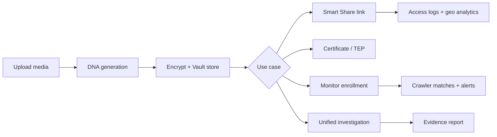
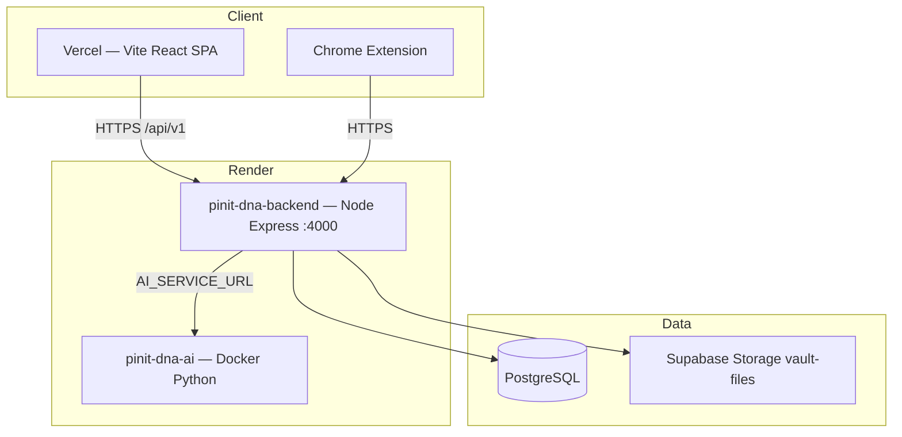

# 01 — Project Overview

**Product:** PINIT-DNA / PinIT Hub  
**Repository:** DNA-PINIT-WEB (monorepo)  
**Document type:** System architecture — project overview  
**Source of truth:** Current codebase under `src/`, `client/`, `python-ai/`, `extension/`, `prisma/`

---

## 1. Project purpose

PINIT-DNA is a **media identity, vault, sharing, and forensic investigation platform**. It generates multi-layer digital DNA fingerprints for images, documents, video, audio, and other file types; encrypts originals into a tenant-scoped vault; issues trackable smart-share links; monitors the public web for matches; and runs unified forensic investigations.

The user-facing brand in the React app is **PinIT Hub** (`client/src/config/brand.config.ts`).

---

## 2. Business problem

Organizations and individuals need to:

1. Prove ownership of digital media without relying on filenames alone.
2. Store sensitive files encrypted, with controlled retrieval and protected downloads.
3. Share files with access tracking, OTP, masking, and forward-chain lineage.
4. Detect unauthorized republishing or tampering across platforms.
5. Produce investigation evidence packages suitable for audit / legal workflows.
6. Operate as individuals or business workspaces with subscription entitlements.

The platform addresses these by combining DNA fingerprinting, AES vault storage, smart links, crawlers, and investigation pipelines in one system.

---

## 3. High-level workflow

Typical owner journey (implemented in UI + API):

1. **Register / login** — shortId JWT auth and/or face biometric (`/api/v1/auth/*`).
2. **Generate DNA** — `POST /api/v1/dna/generate` via Universal File Router + layer engines.
3. **Store in vault** — `POST /api/v1/vault/store` (AES-256-GCM → Supabase `vault-files` or local fallback).
4. **Share** — create smart link; recipients open `/s/:token` or API share viewer endpoints.
5. **Investigate / monitor** — unified investigation, forensic diff, monitoring crawler, Publish Guardian (extension).

---

## 4. Major modules

| Module | Location | Responsibility |
|--------|----------|----------------|
| Express API | `src/app.ts`, `src/server.ts`, `src/api/` | HTTP API, middleware, controllers, routes |
| DNA engine | `src/services/dna*`, `src/services/layers/`, `src/services/engines/` | Multi-layer fingerprint generation & verification |
| Vault | `src/services/vault/` | Encrypt, store, retrieve, protected download, integrity |
| Smart Share | `src/services/share/` | Share links, OTP, masking, analytics, leak attribution |
| Forensics / Investigation | `src/services/forensics/`, `src/services/forensic/` | Unified investigation, diff, matching, scoring |
| Monitoring / Crawler | `src/services/crawler/` | Enroll, scan, YouTube/Bing/GitHub providers, job engine |
| Auth & biometrics | `src/services/auth/` | JWT, refresh tokens, face auth |
| Organization | `src/services/organization/` | Business workspace, team, API keys, webhooks, integrations |
| Subscription / billing | `src/services/subscription/` | Plans, entitlements, Razorpay |
| Publish Guardian | `src/services/publish-guardian/` | Extension protect + protected posts |
| Assets | `src/services/assets/` | Universal asset protection lifecycle |
| Platform events / notifications | `src/services/platform-events/`, notification routes | In-app notifications + SSE |
| React SPA | `client/` | PinIT Hub UI |
| Python AI microservice | `python-ai/` | Embeddings, OCR, CV, forensic scan helpers |
| Chrome extension | `extension/` | Publish Guardian / platform adapters |
| Database | `prisma/schema.prisma` | PostgreSQL via Prisma |
| Storage | `src/lib/supabase-storage.ts` | Supabase Storage bucket `vault-files` |

---

## 5. Tech stack

| Layer | Technology |
|-------|------------|
| Backend language | TypeScript (Node.js ≥ 20) |
| HTTP framework | Express 4 |
| ORM | Prisma 5 |
| Database | PostgreSQL (Supabase and/or Render Postgres) |
| Frontend | React 18, Vite 5, TypeScript, Tailwind CSS 3 |
| Routing (UI) | React Router 7 |
| AI sidecar | Python 3.11, FastAPI/Uvicorn |
| Extension | Chrome Manifest V3 |
| Tests | Jest |
| Logging | Winston + Morgan |
| Validation | Zod (limited — DNA verify body); ad-hoc elsewhere |
| Encryption | AES-256-GCM vault; `@noble/hashes`; JWT (`jsonwebtoken`); bcryptjs (profile password path) |

---

## 6. External services

| Service | Usage in code |
|---------|----------------|
| **Supabase** | PostgreSQL hosting (typical prod); Storage API for vault blobs and org logos |
| **Render** | Backend + AI Docker service (`render.yaml`) |
| **Vercel** | Frontend SPA (`client/vercel.json`) |
| **Razorpay** | Subscription order create + payment verify |
| **Apache Tika** | Optional metadata extraction (`TIKA_URL`, default `localhost:9998`) |
| **YouTube Data API** | Crawler discovery (`YOUTUBE_API_KEY`) |
| **GitHub API** | Crawler (`GITHUB_TOKEN`) |
| **Bing Image Search** | Visual search monitoring (`BING_SEARCH_API_KEY`) |
| **Crawl4AI** | Optional crawler helper (`CRAWL4AI_SERVICE_URL`) |

**Not implemented in current codebase:** SMTP / transactional email delivery, Redis, Stripe/PayPal live billing (enums exist; Razorpay + mock path are implemented), dedicated staging environment config.

---

## 7. Database

- **Engine:** PostgreSQL  
- **Access:** Prisma Client (`src/lib/prisma.ts`)  
- **Schema:** `prisma/schema.prisma` — **77 models**, **18 enums**  
- **Migrations:** `prisma/migrations/` (21 migration folders)  
- **Connection:** `DATABASE_URL` (pooler) + `DIRECT_URL` (migrations / direct)  
- **Tenant rule:** Records are scoped by `ownerUserId` (and optionally `organizationId` / workspace / department)

---

## 8. Storage

| Store | Path / bucket | Purpose |
|-------|---------------|---------|
| Supabase Storage | Bucket `vault-files` | Encrypted vault objects `{ownerUserId}/{vaultId}.enc` |
| Local filesystem | `VAULT_STORAGE_DIR` (default `./vault/encrypted`) | Dev fallback when Supabase not configured |
| Upload temp | `UPLOAD_TEMP_DIR` (default `./tmp/uploads`) | Multer temp files |
| Python AI data | `python-ai/data/` | FAISS / embedding index on disk |
| Org logos | Via `src/lib/org-logo-storage.ts` → `vault-files` | Organization branding |

---

## 9. Authentication

| Mechanism | Implementation |
|-----------|----------------|
| Primary login | User `shortId` → JWT access (7d) + refresh (30d) stored in DB (`RefreshToken`) |
| Account create | Generates `PINIT-XXXXXXXX` shortId + tokens (`authService.createAccount`) |
| Face biometric | `/auth/face/register`, `/auth/face/login` with rate limiter |
| Token transport | `Authorization: Bearer <access>` (SSE also allows `?token=`) |
| Frontend storage | `localStorage` keys `pinit_access_token`, `pinit_refresh_token` |
| Extension OAuth | `POST /auth/extension/issue-code` (auth) + `POST /auth/extension/token` |
| Roles | `UserRole`: `SUPER_ADMIN`, `ADMIN`, `ANALYST`, `AUDITOR`, `USER` |
| Feature gates | `requireFeature(...)` against subscription entitlements |

Password change exists on profile (`PUT /profile/password`); **primary login is shortId (and face), not password-primary**.

---

## 10. Third-party APIs (summary)

Documented in code / `.env.example`:

- Razorpay REST (orders / verify)
- YouTube, GitHub, Bing (crawler)
- Supabase JS client (storage + optional frontend connectivity check)
- Python AI HTTP (`AI_SERVICE_URL`, default `http://localhost:8001`)
- Apache Tika HTTP (`TIKA_URL`)

---

## 11. Deployment overview

| Environment | Frontend | Backend | AI | DB |
|-------------|----------|---------|----|----|
| Local | Vite `:3000` (proxy `/api` → `:4000`) | `npm run dev` → `src/server.ts` | Auto-spawned sidecar `:8001` | Local / Supabase from `.env` |
| Production | Vercel (`client/`) | Render `pinit-dna-backend` | Render `pinit-dna-ai` or external URL | Render blueprint DB and/or Supabase |

Production start script (`npm run start:prod` / `render:start`) normalizes DB env, ensures selected tables, creates vault/tmp dirs, then runs `dist/server.js`.

---

## 12. Related documentation in this folder

This file is part of the system architecture set (`01_Project_Overview` … `15_Tech_Stack`). See `README.md` for the full index.
