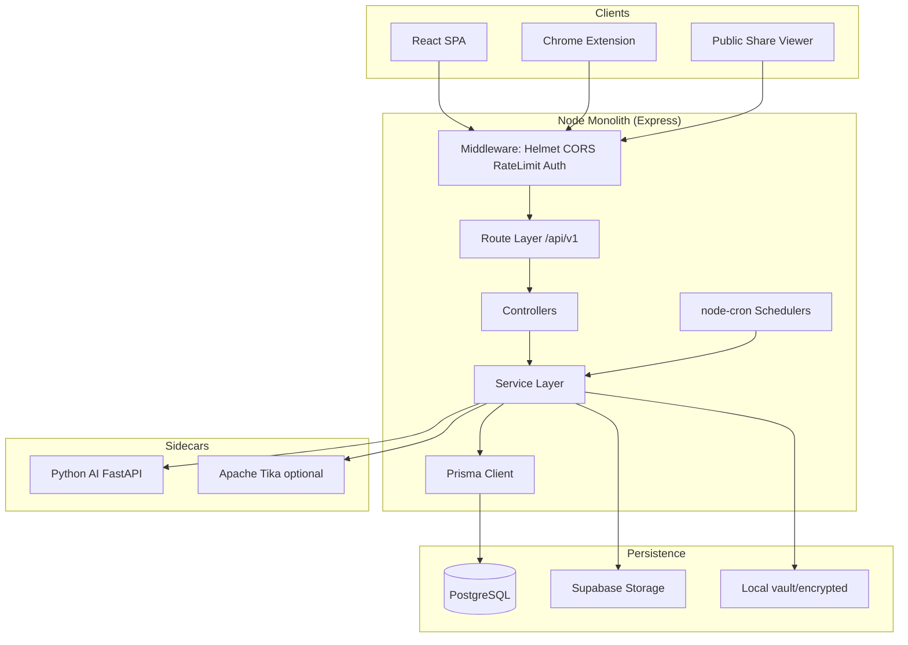
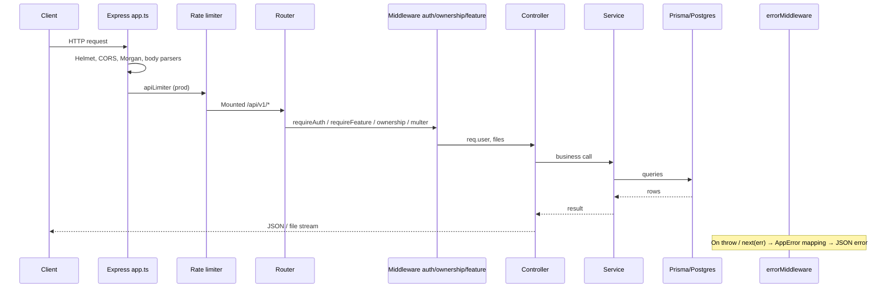
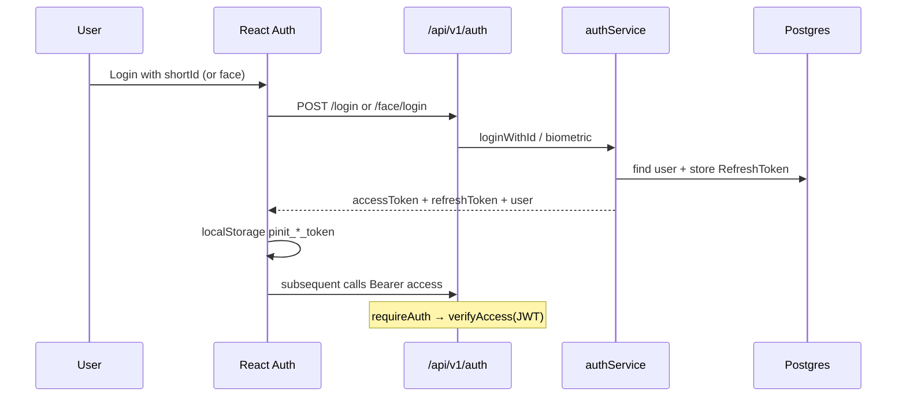
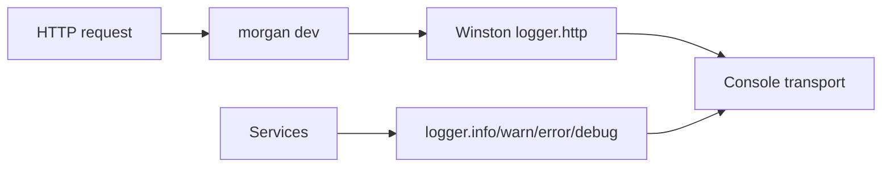
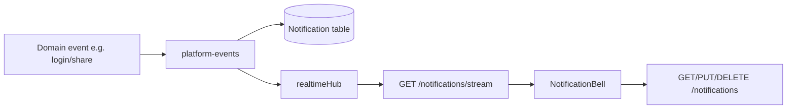

# 02 — System Architecture

**Document type:** Complete monolithic architecture (as implemented)  
**Style:** Single deployable Node monolith + optional Python AI sidecar + React SPA + Chrome extension

---

## 1. Overall architecture

PINIT-DNA is a **modular monolith**:

- One Express process owns HTTP, business services, Prisma DB access, schedulers, and crawler orchestration.
- A **Python AI microservice** is a separate process (local sidecar or Render Docker) called over HTTP.
- The **React SPA** is a separate Vite build (Vercel); production can also serve `client/dist` from Express.
- The **Chrome extension** talks to the same REST API.



There is **no separate microservice mesh** for vault, share, or DNA — those live inside `src/services/*`.

---

## 2. Layered architecture

| Layer | Location | Responsibility |
|-------|----------|----------------|
| **Presentation** | `client/src/pages`, `components`, `layouts` | UI, routing, local state |
| **API / Transport** | `src/api/routes`, `src/app.ts` | HTTP routes, Multer uploads, SSE |
| **Controllers** | `src/api/controllers` | Request parsing, status codes, call services |
| **Middleware** | `src/api/middleware` + subscription guards | Auth, ownership, upload, errors, feature gates |
| **Business / Services** | `src/services/**` | Domain logic (DNA, vault, share, forensics, org, …) |
| **Data access** | Prisma via services + `src/lib/prisma.ts` | **No separate Repository package** — services call Prisma directly |
| **Database** | PostgreSQL | Persistent relational store |
| **Storage** | Supabase / local FS | Encrypted blobs |
| **Config** | `src/config/**` | Typed env + feature flags |
| **Cross-cutting** | `src/lib/logger`, health, tenant-scope | Logging, health, multi-tenant helpers |

### Important architectural fact

**Repository layer:** Not implemented as a distinct folder or pattern. Services use `prisma.*` (and occasional `$queryRaw`) directly. Documented as “service → Prisma → DB”.

**DTO layer:** No dedicated DTO classes. Controllers use inline TypeScript types / `req.body as {…}` and JSON responses shaped as `{ success, data?, error? }`.

---

## 3. Request lifecycle



Startup lifecycle is separate: `bootstrap-env` → `app` export → `server.ts` listen → `onServerReady()` (schedulers, crawler, AI sidecar, keep-alive).

---

## 4. Frontend → Backend → Database flow

```mermaid
flowchart LR
  UI[React page / hook] --> AX[axios api instance<br/>dashboard.api.ts]
  AX -->|Bearer JWT| API[/api/v1/...]
  API --> CTRL[Controller]
  CTRL --> SVC[Service]
  SVC --> P[(Prisma)]
  P --> PG[(PostgreSQL)]
  SVC --> ST[Supabase Storage]
```

- Dev: Vite proxies `/api` → `http://localhost:4000`.
- Prod: `VITE_API_BASE_URL` or hardcoded Render API base in `client/src/config/api.config.ts`.
- Public share page uses bare `axios` without the auth interceptor.

---

## 5. API layer

Mounted in `src/app.ts` under `config.apiPrefix` (default `/api/v1`):

| Mount | Router file |
|-------|-------------|
| `/dna` | `dna.routes.ts` |
| `/vault` | `vault.routes.ts` |
| `/intelligence` | `intelligence.routes.ts` |
| `/certificates` | `certificate-mgmt.routes.ts` |
| `/forensic` | `forensic-diff.routes.ts` |
| `/forensics` | `unified-investigation.routes.ts` |
| `/ai` | `ai.routes.ts` |
| `/monitor` | `monitoring.routes.ts` |
| `/share` | `share.routes.ts` |
| `/recipients` | `recipients.routes.ts` |
| `/evidence` | `evidence.routes.ts` |
| `/auth` | `auth.routes.ts` |
| `/profile` | `profile.routes.ts` |
| `/notifications` | `notification.routes.ts` |
| `/admin` | `admin.routes.ts` |
| `/super-admin` | `super-admin.routes.ts` |
| `/tep` | `tep.routes.ts` |
| `/subscription` | `subscription.routes.ts` |
| `/organization` | `organization.routes.ts` |
| `/` (extension + posts) | `publish-guardian.routes.ts` |
| `/` (assets) | `asset.routes.ts` |

Also: health/ping, extension auth codes, `/s/:token` OG HTML, SPA catch-all.

---

## 6. Business layer

Business rules live in **services**, not controllers. Examples:

- DNA orchestration / verification
- Vault encryption & protected download policy
- Share risk / OTP / masking
- Subscription entitlements (`requireFeature`)
- Organization RBAC (`OWNER|MANAGER|INVESTIGATOR|MEMBER|VIEWER`)
- Investigation acceptance / scoring (forensics + docs contracts)

Controllers should remain thin (parse → call service → respond).

---

## 7. Service layer

Top-level service domains under `src/services/`:

`account`, `ai`, `assets`, `audit`, `auth`, `certificates`, `chain`, `crawler`, `dna`, `duplicate`, `engines`, `evidence`, `forensic`, `forensics`, `identity`, `intelligence`, `layers`, `lineage`, `ocr`, `organization`, `platform-events`, `privacy`, `provenance`, `publish-guardian`, `scheduler`, `semantic`, `share`, `subscription`, `tep`, `text-extraction`, `tika`, `vault`, `verification`, `watermark`

Plus root orchestrators: `dna.orchestrator.ts`, `dna.verifier.ts`, `universal-file-router.ts`, `universal-verifier.ts`, `file-type-detector.ts`.

---

## 8. Repository layer

**Not implemented in current codebase** as a separate abstraction.

Data access pattern:

```
Controller → Service → prisma.<model>.* → PostgreSQL
```

Ownership checks often run in middleware (`ownership.middleware.ts`) before controllers, using Prisma lookups scoped by `ownerUserId`.

---

## 9. Database layer

- Prisma schema defines all tables/enums/relations.
- `src/lib/prisma.ts` exports singleton client.
- `src/bootstrap-env.ts` / `fix-database-url` normalize Supabase pooler passwords.
- Production start scripts may ensure selected tables exist (`scripts/ensure-*.cjs`) in addition to migrations.

---

## 10. Storage layer

```mermaid
flowchart TD
  UP[Multer temp file] --> PIPE[Identity / watermark pipeline optional]
  PIPE --> ENC[AES-256-GCM encrypt]
  ENC --> DEC{USE_LOCAL?}
  DEC -->|dev without Supabase| FS[./vault/encrypted/{id}.enc]
  DEC -->|prod / configured| SB[Supabase vault-files]
  ENC --> META[VaultRecord row in Postgres]
```

Integrity: `vault-blob-integrity` + scheduled integrity checks.

---

## 11. Background jobs

Started from `server.ts` → `onServerReady()`:

| Job | Mechanism | Source |
|-----|-----------|--------|
| Vault integrity | `node-cron` `0 2 * * *` Asia/Kolkata | `vault-scheduler.service.ts` |
| Temp upload cleanup | hourly | same |
| Certificate expiry | `0 3 * * *` Asia/Kolkata | same |
| Share link expiry | `0 4 * * *` Asia/Kolkata | same |
| Monitoring due checks | `*/2 * * * *` if crawler enabled | same |
| Crawler engine schedule | `CRAWLER_SCHEDULE_CRON` or interval | `crawler/engine/scheduler.ts` |
| Monitoring kickstart | `setTimeout` 12s | `server.ts` |
| AI auto-reindex | `setTimeout` 20s | `server.ts` |
| Render keep-alive | `setInterval` 14 min | `server.ts` (production + `RENDER_EXTERNAL_URL`) |

**Not implemented:** Redis queues, BullMQ, worker processes.

---

## 12. Scheduled tasks

See table above. All in-process within the monolith (and crawler engine when enabled).

---

## 13. Authentication flow



Refresh: `POST /auth/refresh` rotates refresh token row. Logout deletes refresh token.

---

## 14. Authorization flow

Layers of authorization (all present in code):

1. **Authentication** — `requireAuth` / `requireAuthSse`
2. **Platform role** — `requireAdmin` (ADMIN), `requireSuperAdmin`, `requireAdminOrSuper`
3. **Record ownership** — `requireDnaOwnership`, `requireVaultOwnership`, `requireShareLinkOwnership`, etc.
4. **Subscription feature** — `requireFeature(FeatureKey.*)`
5. **Organization RBAC** — enforced inside organization services (not a global Express middleware for all routes)

Multi-tenant isolation helper: `getAuthUserId` / tenant-scope utilities.

---

## 15. Error handling flow

1. Controllers `try/catch` → `next(err)` or throw (with `express-async-errors`).
2. `errorMiddleware` maps:
   - Domain errors (`SubscriptionRequiredError`, storage/quota, account-plan)
   - `AppError(statusCode, message, details?)`
   - Errors with `.status`
   - Multer / unsupported type → 400
   - Vault / Supabase unavailable → 503
   - Else → 500 `{ success: false, error: 'Internal server error' }`
3. Feature middleware may return 403 JSON directly.

---

## 16. Logging flow



- Dev: colorized printf
- Prod: JSON
- Level: `LOG_LEVEL` / `config.log.level`
- **Not implemented:** log shipping (Datadog, ELK, etc.)

---

## 17. File upload flow

1. Client `multipart/form-data` (field names: typically `image`, or `fileA`/`fileB`, investigation memory upload).
2. Multer (`upload.middleware.ts`) writes to `UPLOAD_TEMP_DIR` or memory.
3. Controller/service detects type (`file-type-detector` / UniversalFileRouter).
4. DNA / vault / investigation pipeline processes path or buffer.
5. Temp cleanup via scheduler (and local handlers).

Route-local Multer also used for Publish Guardian / assets (larger limits up to 500MB).

---

## 18. Notification flow



**Email notifications:** Not implemented (OTP for share is generated and logged; comments state no SMTP).

---

## 19. Email flow

**Not implemented in current codebase.**

- No nodemailer / Resend / SendGrid dependency.
- Share OTP path documents that email is not sent.

Org “integrations” (Slack/Teams/Zapier/Dropbox/Google Drive) store connection config and expose test endpoints — not SMTP email.

---

## 20. Cache flow

| Kind | Status |
|------|--------|
| Redis / shared cache | **Not implemented** |
| In-process forensic computation cache | Implemented (`forensic-computation-cache.service.ts` — Map, TTL 15 min, max 200) |
| Frontend module caches | `useSubscription`, `useOrganization` invalidate helpers |
| Python FAISS disk index | AI service local data dir |
| Vectra | Present in Node dependencies for vector use — not a Redis cache |

---

## 21. Security flow (summary)

See `09_Security_Architecture.md` for detail. Stack highlights:

- Helmet (CSP disabled)
- CORS allowlist (localhost, ngrok, vercel, pinithub, extensions, `ALLOWED_ORIGIN(S)`)
- Rate limiting (production; biometric limiter on face routes)
- JWT Bearer auth
- Vault AES-256-GCM + master secret / HKDF
- Ownership middleware
- Prisma parameterized queries (SQL injection mitigation)
- Secrets via environment variables

---

## 22. Monolith boundaries

| In-process | Out-of-process |
|------------|----------------|
| DNA, vault, share, org, billing verify, crawler orchestration, notifications | Python AI HTTP |
| Schedulers | Optional Tika HTTP |
| Serving SPA static in prod (if `client/dist` present) | Vercel-hosted SPA (typical prod frontend) |
| | Supabase Storage HTTP API |
| | Chrome extension (client) |
