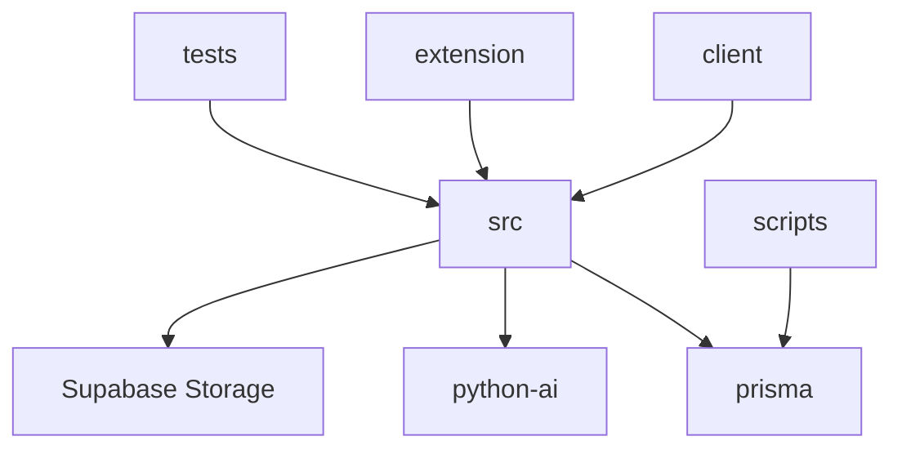

# 03 — Folder Structure

Every important top-level and major nested folder in the monorepo, based on the current tree.

---

## Repository root

| Folder / file | Purpose |
|---------------|---------|
| `src/` | Node/Express backend TypeScript source |
| `client/` | React + Vite frontend (PinIT Hub UI) |
| `python-ai/` | FastAPI AI microservice |
| `extension/` | Chrome MV3 PinIT Hub / Publish Guardian extension |
| `prisma/` | Schema, migrations, seed |
| `docs/` | Product and architecture documentation |
| `docs/architecture/` | Architecture contracts + this system architecture set |
| `scripts/` | Ops helpers (DB ensure, ports, docx, temp tests) |
| `tests/` | Jest tests (forensics, validation, extension, …) |
| `supabase/` | SQL scripts (e.g. `hoid_identities.sql`) not fully in Prisma |
| `public/` | Static fallback if React build missing |
| `vault/` | Local encrypted vault files (dev; gitignored content) |
| `tmp/` | Upload temp + misc runtime files |
| `data/` | Runtime/data artifacts as used by tooling |
| `coverage/` | Jest coverage output |
| `dist/` | Compiled backend JS (`tsc`) |
| `mockups/` | HTML product mockups (not runtime) |
| `validation/` | Validation datasets / readiness assets |
| `pinit-ai-service/` | Hugging Face Spaces stub (README only; no app source) |
| `node_modules/` | Backend dependencies |
| `.claude/` | Claude tooling (not application runtime) |
| `ARCHITECTURE.md` | Early foundation architecture notes (partially stale vs schema) |
| `CLAUDE.md` | Project rules for agents / deployment checklist |
| `README.md` | Setup overview (early DNA-focused; partially stale) |
| `render.yaml` | Render blueprint |
| `package.json` | Backend + monorepo scripts |
| `.env` / `.env.example` | Environment configuration |

---

## `src/` — Backend

### Purpose
Express application source: API, services, config, libs.

### Structure

```
src/
  app.ts              # Express app factory (no listen)
  server.ts           # HTTP listen + onServerReady
  bootstrap-env.ts    # DB URL fix before imports
  api/
    routes/           # Express routers
    controllers/      # HTTP handlers
    middleware/       # auth, upload, ownership, errors, roles
  config/             # Typed config + DNA/feature flags
  constants/          # Shared constants
  lib/                # prisma, logger, supabase, health, tenant-scope
  services/           # Domain services (majority of business logic)
  types/              # Shared TS types (e.g. forensic-diff)
  validation/         # Validation helpers (if present)
  scripts/            # Backend-side scripts under src
```

### Responsibilities
- Serve `/api/v1/*`
- Optionally serve `client/dist` SPA
- Run cron/crawler/AI kickoff after listen

### Dependencies
- `prisma/`, env, optional `python-ai`, Supabase, Tika

### Examples
- `src/api/routes/vault.routes.ts` → `vault.controller.ts` → `services/vault/*`
- `src/services/layers/layer1.*.ts` DNA layer implementations

---

## `src/api/`

| Subfolder | Purpose | Files | Dependencies |
|-----------|---------|-------|--------------|
| `routes/` | Map HTTP paths to controllers + middleware | `*.routes.ts` (auth, dna, vault, share, …) | controllers, middleware, feature guards |
| `controllers/` | Parse request / shape response | `*.controller.ts` | services, lib |
| `middleware/` | Cross-cutting HTTP concerns | `auth`, `upload`, `ownership`, `error`, `role` | auth service, prisma, multer |

**Examples:** `requireAuth` sets `req.user`; `uploadSingle` attaches file; `errorMiddleware` formats errors.

---

## `src/services/`

### Purpose
Business logic. Each subdirectory is a domain module.

| Folder | Responsibility |
|--------|----------------|
| `account/` | Account-type vs plan rules |
| `ai/` | Python AI HTTP client + indexing |
| `assets/` | Universal asset protect lifecycle |
| `audit/` | Audit event recording |
| `auth/` | JWT + biometric auth |
| `certificates/` | Certificate issue/revoke/verify |
| `chain/` | Forward-chain graph |
| `crawler/` | Monitoring + engine + providers |
| `dna/` | Enterprise DNA packaging / identity |
| `duplicate/` | Duplicate detection on upload |
| `engines/` | Per-file-type DNA engines |
| `evidence/` | Evidence packages & signing |
| `forensic/` | Diff orchestrator, IP intel, text/image diffs |
| `forensics/` | Large investigation / match / OCR / watermark suite |
| `identity/` | Embeddings, integrity manifests, recovery |
| `intelligence/` | Content extract + intelligence reports |
| `layers/` | DNA layers 1–15 implementations |
| `lineage/` | Document lineage |
| `ocr/` | OCR orchestration |
| `organization/` | Org, team, webhooks, integrations, API keys |
| `platform-events/` | Events, notifications, realtime SSE hub |
| `privacy/` | Share masking |
| `provenance/` | Chain of custody / tracking |
| `publish-guardian/` | Extension protect + posts |
| `scheduler/` | Vault / cert / share / monitor cron |
| `semantic/` | Non-AI semantic helpers |
| `share/` | Smart links |
| `subscription/` | Plans, entitlements, Razorpay, guards |
| `tep/` | Tracked Export Package |
| `text-extraction/` | Document text |
| `tika/` | Apache Tika client |
| `vault/` | Encrypt/store/retrieve/protect |
| `verification/` | Comparison / fingerprint helpers |
| `watermark/` | Watermark embed/recover |

**Dependencies:** Prisma, config, lib, external HTTP APIs.  
**Examples:** `vault.service.ts`, `share-link.service.ts`, `unified-investigation.orchestrator.ts`.

---

## `src/config/`

**Purpose:** Central configuration and feature flags.  
**Files:** `index.ts`, `supported-file-types.ts`, `dna-versions.ts`, `dna-phase2.ts`, `dna-phase3.ts`, `enterprise-feature-flags.ts`, watermark/local-dna/investigation policies, etc.  
**Rule:** Prefer `import { config } from './config'` over raw `process.env` in app code (env still read inside config modules).

---

## `src/lib/`

**Purpose:** Shared infrastructure utilities.

| File | Role |
|------|------|
| `prisma.ts` | Prisma client singleton |
| `logger.ts` | Winston |
| `supabase-storage.ts` | Vault blob upload/download |
| `health.ts` | Health report for `/health` |
| `tenant-scope.ts` | Auth user id / ownership helpers |
| `graceful-shutdown.ts` | Process shutdown |
| `python-ai-process.ts` | Spawn local AI |
| `fix-database-url.ts` | Supabase URL encoding |
| `platform-owner.ts` | Super-admin shortId gate |
| `org-logo-storage.ts` | Logo uploads |

---

## `client/` — Frontend

```
client/
  src/
    main.tsx, App.tsx, router.tsx, index.css
    admin/          # Super Admin control center
    components/     # UI + feature components
    config/         # api, brand, dna-versions
    context/        # Auth, AccountViewMode
    hooks/
    layouts/        # Dashboard, Onboarding
    lib/            # auth tokens, face, forensic helpers
    pages/          # Route pages
    services/       # API clients + report exporters
    types/
    utils/
  public/
  dist/             # Vite build output
  vercel.json
  vite.config.ts
  package.json
  .env.development / .env.production / .env.ngrok
```

### Purpose
PinIT Hub SPA: vault, DNA, investigation, business org, subscription, share viewer.

### Dependencies
Backend `/api/v1` (proxied in dev); optional Supabase browser client for connectivity check.

### Notes
- `App.tsx` is the **DNA generate pipeline UI**, not the app root (`main.tsx` + `router.tsx` are).
- **No Redux/Zustand.** Context + local state only.
- Capacitor/Android: **Not present** in current tree.

---

## `client/src/admin/`

**Purpose:** Platform Super Admin UI (`/admin/*`).  
**Contains:** `routes.tsx`, `layout/`, `pages/`, `api/super-admin.api.ts`, `components/`.  
**Gate:** `RequireSuperAdmin` (role + platform-owner shortId).

---

## `python-ai/`

**Purpose:** Embeddings, OCR, computer vision, forensic scan helpers.  
**Key files:** `main.py`, `config.py`, `Dockerfile`, `requirements.txt`, `services/*`.  
**Port:** Local 8001; Docker uses `$PORT` (default 7860).  
**Dependencies:** Called by `src/services/ai/`.

---

## `extension/`

**Purpose:** Browser extension for publish protect / platform hooks.  
**Structure:** `manifest.json`, `background/`, `content/` (+ adapters), `popup/`, `options/`, `shared/`, `icons/`, `test/`.  
**Dependencies:** Backend API (Render / localhost / pinithub hosts in permissions).

---

## `prisma/`

| Path | Purpose |
|------|---------|
| `schema.prisma` | Full data model |
| `migrations/` | SQL migration history |
| `seed.ts` | Seed script (via `npm run db:seed`) |

---

## `docs/`

**Purpose:** Human documentation (roadmaps, enterprise specs, architecture).  
**`docs/architecture/`:** System architecture set (`01_Project_Overview` … `15_Tech_Stack`).

---

## `scripts/`

**Purpose:** Operational Node/Python helpers — free ports, ensure tables, normalize DB env, temporary diagnostics, doc generation.  
**Not** part of the Express request path (except when `server.ts` requires `free-dev-ports.cjs`).

---

## `tests/`

**Purpose:** Automated Jest tests for forensics, validation readiness, extension adapters, etc.  
**Runner:** root `npm test` → Jest.

---

## `supabase/`

**Purpose:** SQL assets for Supabase-specific tables (e.g. HOID identities with RLS) that are **not** fully modeled in Prisma.

---

## `vault/`, `tmp/`, `dist/`, `coverage/`

Runtime / build artifacts. Encrypted vault files and uploads should not be committed.

---

## `mockups/`, `validation/`, `pinit-ai-service/`

| Folder | Role |
|--------|------|
| `mockups/` | Static HTML UX explorations |
| `validation/` | Validation / golden dataset support |
| `pinit-ai-service/` | HF Spaces metadata stub only |

---

## Folder dependency (high level)


