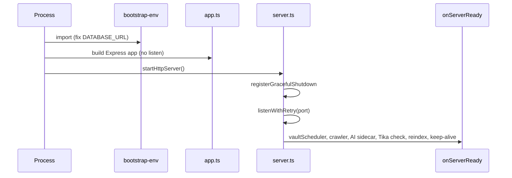
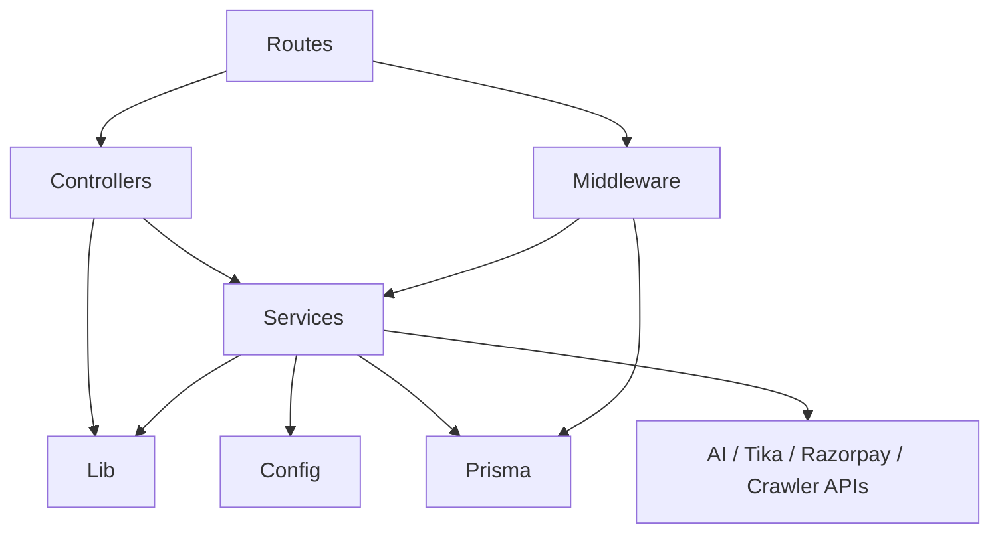

# 04 — Backend Architecture

**Runtime:** Node.js ≥ 20, TypeScript, Express 4  
**Entry:** `src/server.ts` → imports `src/app.ts`

---

## 1. Application startup



| Step | Code |
|------|------|
| Env / DB URL fix | `src/bootstrap-env.ts` → `fix-database-url` |
| App wiring | `src/app.ts` — middleware, routes, error handler |
| Listen | `src/server.ts` — `listenWithRetry` on `config.port` (default 4000) |
| Post-listen | Schedulers, optional crawler, non-prod Python AI spawn, health keep-alive |

Production: `npm run build` → `npm run start:prod` / `render:start` (normalize DB, ensure tables, mkdir vault/tmp, `node dist/server.js`).

---

## 2. Routes

Routers live in `src/api/routes/` and are mounted in `app.ts` under `config.apiPrefix` (`/api/v1`).

See **07_API_Documentation.md** for the full endpoint catalog.

Pattern:

```ts
router.METHOD(path, ...middleware, controllerFn);
```

---

## 3. Controllers

Location: `src/api/controllers/`.

Responsibilities:

- Read `req.body` / `req.params` / `req.file(s)` / `req.user`
- Call one or more services
- Return `res.status(...).json({ success, data?, error? })` or stream files
- Pass errors via `next(err)`

Examples: `auth.controller.ts`, `vault.controller.ts`, `share-link.controller.ts`, `unified-investigation.controller.ts`.

---

## 4. Services

Location: `src/services/**`.

This is the **primary business layer**. Controllers should not contain DNA algorithms, encryption, or Prisma-heavy workflows.

Notable orchestrators:

- `dna.orchestrator.ts` / `dna.verifier.ts`
- `universal-file-router.ts`
- `forensics/unified-investigation.orchestrator.ts`
- `vault/*`, `share/*`, `crawler/*`

---

## 5. Repositories

**Not implemented in current codebase** as a dedicated layer.

Services import `prisma` from `src/lib/prisma.ts` and call:

- `prisma.model.findMany/create/update/delete/...`
- occasional `$queryRaw` / `$executeRaw` (e.g. auth user helpers)

---

## 6. Models

Persistent models are defined in **`prisma/schema.prisma`** (not Mongoose / TypeORM entities).

Runtime access: `@prisma/client` generated types.

In-memory / algorithmic “models” also exist as TypeScript interfaces under `src/types/` and within service modules (e.g. investigation manifests).

---

## 7. DTOs

**Not implemented** as a formal DTO package.

Request shaping:

- Inline casts: `req.body as { shortId: string }`
- Multer fields for files
- Zod schema in DNA verify path (`verifyBodySchema` in `dna.controller.ts`)

Response convention (most endpoints):

```json
{ "success": true, "data": { } }
```

or

```json
{ "success": false, "error": "message" }
```

---

## 8. Middleware

| Middleware | File | Role |
|------------|------|------|
| Helmet | `app.ts` | Security headers (CSP off) |
| CORS | `app.ts` | Origin allowlist |
| Morgan | `app.ts` | HTTP → Winston |
| Body parsers | `app.ts` | JSON 1mb, urlencoded |
| Rate limit | `app.ts` | Global API limiter (prod) |
| `requireAuth` / `requireAuthSse` | `auth.middleware.ts` | JWT verification |
| `requireSuperAdmin` / `requireAdminOrSuper` | `role.middleware.ts` | Role gates |
| `requireAdmin` | inside `admin.controller.ts` | ADMIN only |
| Ownership family | `ownership.middleware.ts` | Tenant ownership |
| Upload family | `upload.middleware.ts` | Multer disk/memory |
| `requireFeature` | `subscription/guards/require-feature.middleware.ts` | Entitlements |
| `errorMiddleware` | `error.middleware.ts` | Central errors |
| Biometric limiter | `auth.routes.ts` | Face register/login rate limit |

---

## 9. Utilities (`src/lib/`)

Shared infra: Prisma, logger, health, Supabase storage, tenant scope, request IP helpers, graceful shutdown, Python process manager, MIME normalize, org logo storage, platform owner checks, investigation error sanitization, stage timers.

---

## 10. Validation

| Approach | Status |
|----------|--------|
| Zod request middleware (global) | **Not implemented** |
| Zod in DNA verify body | Implemented in `dna.controller.ts` |
| Ad-hoc field checks | Dominant pattern in controllers |
| File type / size | Multer + `supported-file-types` + UniversalFileRouter |
| Env typing | `src/config/index.ts` (`required` / `optional` / `optionalInt`) |

---

## 11. Authentication

Service: `src/services/auth/auth.service.ts`

| Concern | Detail |
|---------|--------|
| Access JWT | 7d, payload `{ sub, shortId, name, role }` |
| Refresh JWT | 30d, stored in `refresh_tokens` |
| Secret | `config.jwt.secret` ← `JWT_SECRET` |
| Create | Auto shortId `PINIT-` + 8 chars |
| Login | `loginWithId(shortId)` |
| Face | `face-auth.controller` + biometric services |
| Extension | issue-code / token exchange |

---

## 12. Authorization

1. JWT present and valid  
2. Optional role middleware  
3. Optional ownership middleware (`ownerUserId` match)  
4. Optional `requireFeature`  
5. Org-level RBAC inside organization services  

Platform owner shortId check for Super Admin UI/API alignment (`platform-owner` helpers).

---

## 13. Exception handling

- `express-async-errors` packages async route errors
- Domain error classes for subscription/storage/quota
- `AppError` with status codes
- Final `errorMiddleware` — never leak stack to clients on generic 500

---

## 14. Dependency flow



**Rule of thumb:** Routes → Controllers → Services → Prisma/External. Controllers should not import sibling controllers; services may compose other services.

---

## 15. Database connection

```ts
// src/lib/prisma.ts — singleton PrismaClient
// DATABASE_URL required via config.db.url
```

- Pooler URL for app traffic; `DIRECT_URL` for migrations
- Bootstrap may URL-encode special characters in passwords

---

## 16. Environment variables

Canonical list: `.env.example` + additional reads in `src/config/**` and crawler/AI modules.

Critical groups:

- Server: `NODE_ENV`, `PORT`, `API_PREFIX`
- DB: `DATABASE_URL`, `DIRECT_URL`
- Vault/Storage: `VAULT_*`, `SUPABASE_*`
- Auth: `JWT_SECRET`, `BIOMETRIC_ENCRYPTION_KEY`
- Share: `PUBLIC_APP_URL`, `SHARE_HMAC_SECRET`
- AI: `AI_SERVICE_URL`, `AI_SERVICE_PORT`
- Billing: `RAZORPAY_*`, `SUBSCRIPTION_*`
- Crawler: `MONITORING_CRAWLER_ENABLED`, `CRAWLER_ENGINE_ENABLED`, API keys
- DNA feature flags: `DNA_*`, `DNA_PHASE2_*`, `DNA_PHASE3_*`

---

## 17. Configuration

`src/config/index.ts` exports typed `config` object covering port, upload, DNA versions, stego secret, vault, JWT, biometric thresholds, rate limits, subscription enforcement, Razorpay, log level.

Feature-specific modules: `dna-phase2.ts`, `dna-phase3.ts`, `enterprise-feature-flags.ts`, `supported-file-types.ts`, investigation policies, etc.
