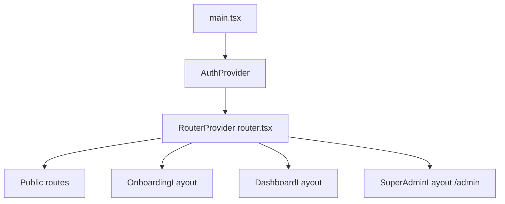
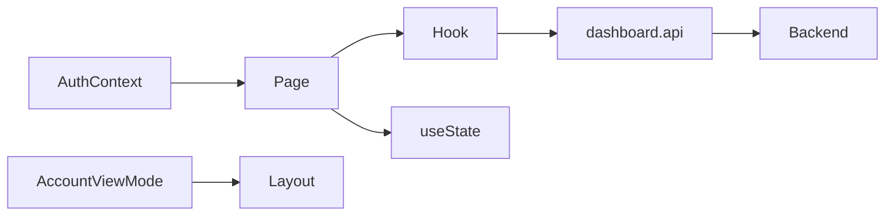
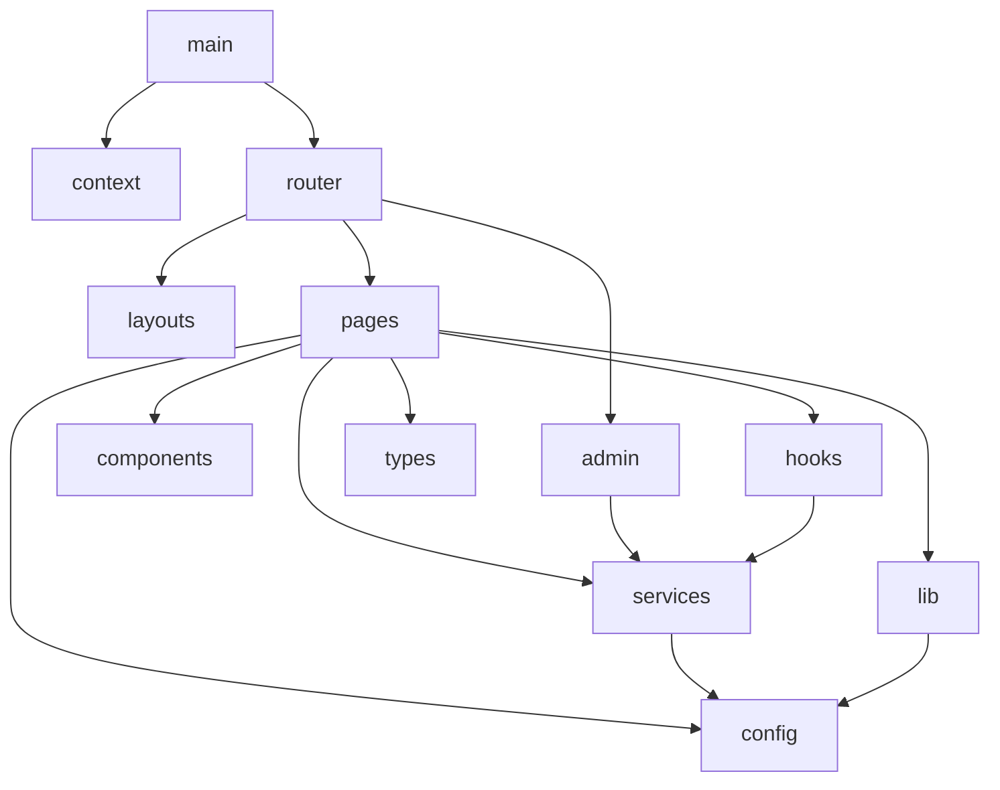

# 05 — Frontend Architecture

**App name (UI):** PinIT Hub  
**Stack:** React 18, Vite 5, TypeScript, Tailwind CSS 3, React Router 7  
**Root:** `client/src/main.tsx`

---

## 1. Entry & composition

- `AuthProvider` wraps the tree (`context/AuthContext.tsx`).
- On boot: optional Supabase session check; `warmBackend()`.
- **`App.tsx` is not the root** — it is the DNA generation wizard used by `GeneratePage`.

---

## 2. Pages

Routed pages live primarily under `client/src/pages/` and `client/src/admin/pages/`.

### Public / auth
`/login`, `/register`, `/register/account-type`, `/face-auth`, `/s/:token` (ShareViewer — **no auth**)

### Authenticated dashboard (selected)
`/`, `/generate`, `/vault`, `/dna-records`, `/search`, `/monitoring`, `/forensic-diff`, `/pinit-hub/investigation`, `/certificates`, `/subscription/*`, `/business/*`, `/assets`, `/protected-posts`, `/profile`, `/admin-portal`, …

### Super Admin
`/admin/*` — executive dashboard, users, vault explorer, DNA, certificates, investigations, tracking, monitoring, analytics, audit, security center; some sidebar entries are `PlaceholderPage`.

Full path table: see exploration of `client/src/router.tsx` + `client/src/admin/routes.tsx` (also summarized in § Protected routes).

**Orphan pages on disk (not wired in router):** e.g. `ComparePage.tsx`, `ForensicDashboardPage.tsx`, `VerifyLeakedFilePage.tsx`, user `SecurityCenterPage.tsx`, `enterprise/EnterpriseDashboardPage.tsx` (redirected), admin `VaultManagementPage.tsx`.

---

## 3. Components

`client/src/components/`:

| Area | Examples |
|------|----------|
| `auth/` | RequireAuth, FaceAuth, biometric capture |
| `nav/` | Sidebar, Topbar, MobileBottomNav, NotificationBell |
| `subscription/` | HomeRedirect, DashboardGate, RequireFeature, quota banners |
| `business/` | Setup wizard, profile panels, ops sections |
| `onboarding/` | Account-type gates |
| `ui/` | PageShell, Modal, Badge, EmptyState, Skeleton, TableWrap |
| `maps/` | Tracking / dashboard maps |
| Root feature | UploadZone, LayerPipeline, InvestigationScanner, Vault panels, …

Reusable primitives concentrate under `components/ui/`. Feature components sit beside domain folders.

---

## 4. Layouts

| Layout | Path | Role |
|--------|------|------|
| `DashboardLayout` | `layouts/DashboardLayout.tsx` | Sidebar + Topbar + MobileBottomNav; wraps `AccountViewModeProvider` + `DashboardGate` |
| `OnboardingLayout` | `layouts/OnboardingLayout.tsx` | Auth-styled shell without chrome |
| `SuperAdminLayout` | `admin/layout/SuperAdminLayout.tsx` | Dark admin shell + sidebar |

---

## 5. Hooks

`client/src/hooks/`:

| Hook | Purpose |
|------|---------|
| `useApi` | Generic fetch state helper |
| `useSubscription` | Plan/features (+ module cache) |
| `useOrganization*` | Org profile, team, departments, workspaces |
| `useBusinessDashboard` | Business home polling |
| `useUserProfile` | Display profile |
| `useSyncBusinessSetup` | Business setup sync |
| `useTheme` | light/dark via `localStorage` |
| `useMediaRecorder` / `useAutoDocumentCapture` | Capture pipelines |
| `useAccountViewMode` | Re-export of context |

---

## 6. Contexts

| Context | File | State |
|---------|------|-------|
| Auth | `context/AuthContext.tsx` | `user`, `loading`, login/logout helpers |
| Account view mode | `context/AccountViewModeContext.tsx` | Individual vs Business shell (inside dashboard) |

---

## 7. Redux / Zustand

**Not implemented in current codebase.**

State approach:

- React Context (auth, account mode)
- Component `useState` / `useEffect`
- Module-level caches in hooks
- `localStorage` for tokens, theme, onboarding keys, some forensic report caches

---

## 8. API layer

| Module | Role |
|--------|------|
| `config/api.config.ts` | `API_BASE_URL` |
| `services/dashboard.api.ts` | Axios `api` instance + JWT interceptor + domain helpers |
| `services/api.ts` | DNA generate / vault store helpers |
| `lib/auth.ts` | Auth HTTP (bare axios), token save/refresh/clear, warmBackend |
| `admin/api/super-admin.api.ts` | Super-admin endpoints via shared `api` |
| `services/report-generator.ts` / `investigation-report-export.ts` | Client-side exports |
| `ShareViewerPage` | Bare axios to public share APIs |

Interceptor behavior (`dashboard.api.ts`):

- Attach `Authorization: Bearer` from `pinit_access_token`
- On 401 → refresh access token; retry
- Cold-start / 5xx retry heuristics

**Project rule:** Authenticated calls should use `api` from `dashboard.api.ts`, not bare axios (except intentional public/auth bootstrap paths).

---

## 9. State flow

Server remains source of truth for vault/DNA/share; UI caches lightly for UX.

---

## 10. Authentication (UI)

1. Tokens in `localStorage`: `pinit_access_token`, `pinit_refresh_token`
2. `AuthProvider` parses JWT on load; refreshes if expired
3. Login via shortId (`LoginFlow`) or face (`FaceLoginPage`)
4. Register via `RegistrationFlow` after pre-register account type
5. Logout clears tokens + session caches (`pinit_*`)

---

## 11. Protected routes

| Guard | Behavior |
|-------|----------|
| `RequireAuth` | Redirect `/login` if unauthenticated |
| `RequireAccountTypeOnboarding` | Force account-type onboarding if incomplete |
| `RequireSuperAdmin` | Super Admin shortId + `SUPER_ADMIN` role for `/admin` |
| `HomeRedirect` | `/` → business dashboard or personal `DashboardPage` |
| `DashboardGate` | Quota banner + outlet |
| `RequireFeature` (component) | Feature-gated UI sections |

Public exception: `/s/:token`.

---

## 12. Reusable components

Prefer `components/ui/*` for chrome-less building blocks; compose feature components rather than duplicating PageShell/Modal patterns.

Maps, investigation scanners, and biometric capture are specialized reusable modules reused across pages/admin.

---

## 13. Folder dependency

`ForensicDiffPage` imports types from repo-root `src/types/forensic-diff.types` (backend shared types path) — a cross-package import to be aware of during refactors.

---

## 14. Build & deploy (frontend)

- Dev: Vite port **3000**, proxy `/api` → backend **4000**
- Build: `tsc && vite build`; assets emitted under `dist/static/` (avoids clash with `/assets` route)
- Vercel: `client/vercel.json` SPA rewrites to `index.html`
