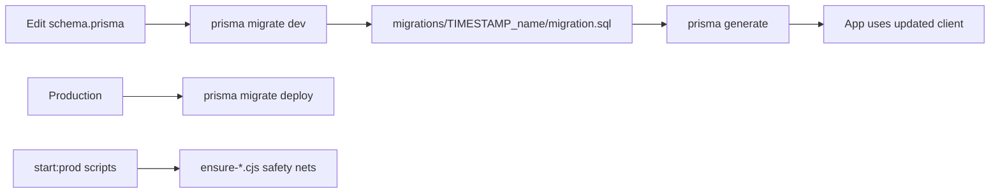

# 06 — Database Architecture

**ORM:** Prisma 5  
**Engine:** PostgreSQL  
**Schema file:** `prisma/schema.prisma`  
**Models:** 77  
**Enums:** 18  
**Migrations:** 21 folders under `prisma/migrations/`

---

## 1. Connection

| Variable | Role |
|----------|------|
| `DATABASE_URL` | App connection (often Supabase pooler / PgBouncer) |
| `DIRECT_URL` | Direct Postgres for migrations |

Datasource block uses both URLs. Bootstrap may URL-encode special characters in passwords.

---

## 2. ER diagram (core domains)

```mermaid
erDiagram
  User ||--o{ DnaRecord : owns
  User ||--o| Organization : owns
  User ||--o| Subscription : has
  User ||--o{ RefreshToken : has
  User ||--o{ Notification : receives
  User ||--o| BiometricIdentity : has

  Organization ||--o{ Workspace : has
  Organization ||--o{ Department : has
  Organization ||--o{ OrganizationMember : has
  Organization ||--o{ OrganizationInvite : has
  Organization ||--o{ OrganizationApiKey : has
  Organization ||--o{ OrganizationWebhook : has
  Organization ||--o{ OrganizationIntegration : has

  DnaRecord ||--|| CryptoLayer : has
  DnaRecord ||--|| StructuralLayer : has
  DnaRecord ||--|| PerceptualLayer : has
  DnaRecord ||--|| SemanticLayer : has
  DnaRecord ||--|| MetadataLayer : has
  DnaRecord ||--|| StegoLayer : has
  DnaRecord ||--o| VaultRecord : vaulted
  DnaRecord ||--o| OcrRecord : ocr
  DnaRecord ||--o{ VerificationLog : logs
  DnaRecord ||--o{ MonitorRecord : monitored
  DnaRecord ||--o{ TrackedExportPackage : tep
  DnaRecord ||--o{ Certificate : certs
  DnaRecord ||--o{ ShareLink : "via vault/dna refs"
  DnaRecord ||--o{ ProtectedPost : optional
  DnaRecord ||--o{ Asset : optional

  MonitorRecord ||--o{ CrawlResult : results
  MonitorRecord ||--o{ CrawlerJob : jobs
  MonitorRecord ||--o{ CrawlerMatch : matches

  ShareLink ||--o{ ShareAccessLog : access
  ShareLink ||--o{ BlockedShareViewer : blocks
  ShareLink ||--o{ UnmaskRequest : unmask
  ShareLink ||--o{ ShareLink : parentChild

  Plan ||--o{ Subscription : plans
  Subscription ||--o{ BillingHistory : bills
  Subscription ||--o{ UsageRecord : usage

  Incident ||--o{ EvidenceRecord : evidence

  Asset ||--o{ AssetTimelineEvent : timeline
  Asset ||--o{ AssetDiscovery : discoveries
  ProtectedPost ||--o{ ProtectedPostTimelineEvent : timeline
  ProtectedPost ||--o{ ProtectedPostDiscovery : discoveries

  LocalFeatureIndex ||--o{ LocalDnaPatch : patches
  DnaRecord ||--o| LocalFeatureIndex : localDna
```

Full field-level detail is in `prisma/schema.prisma`. The diagram above shows primary relationship topology.

---

## 3. Relationships (summary)

| Parent | Child / related | Cardinality notes |
|--------|-----------------|-------------------|
| `User` | `DnaRecord`, shares, certs, sessions, devices, posts, assets | 1:n (tenant root) |
| `User` | `Organization` (owned) | 1:1 owner |
| `User` | `Subscription` | 1:1 |
| `User` | `BiometricIdentity` | 1:1 |
| `DnaRecord` | Layer tables (`CryptoLayer` … `BiometricBindLayer`) | 1:1 each (`dnaRecordId` unique) |
| `DnaRecord` | `VaultRecord` | 1:1 |
| `DnaRecord` | `MonitorRecord`, `VerificationLog`, `TrackedExportPackage` | 1:n |
| `ShareLink` | self via `parentLinkId` | hierarchy / forward chain |
| `ShareLink` | `ShareAccessLog`, `BlockedShareViewer`, `UnmaskRequest` | 1:n |
| `Organization` | members, invites, workspaces, departments, keys, webhooks, integrations | 1:n |
| `Plan` | `Subscription` | 1:n |
| `Incident` | `EvidenceRecord` | 1:n |
| `LocalFeatureIndex` | `LocalDnaPatch` | 1:n |
| `ProtectedPost` / `Asset` | timeline + discovery tables | 1:n |

Some tables (e. and `AuditEvent`, `FileTamperEvent`, `FeatureEntitlement`) store foreign key *values* with indexes but **without** declared Prisma relation fields — treat as soft references.

---

## 4. Primary keys

Convention across nearly all models:

- `id String @id @default(uuid())`

Natural / business unique keys (examples):

| Model | Unique business key |
|-------|---------------------|
| `User` | `shortId`, optional `email` |
| `Organization` | `shortId`, `ownerUserId` |
| `ShareLink` | `token` |
| `Certificate` | `certificateId` |
| `TrackedExportPackage` | `tepCode` |
| `Incident` | `incidentCode` |
| `EvidenceRecord` | `evidenceCode` |
| `Plan` | `code` |
| `ExtensionAuthCode` | `code` |
| `RefreshToken` | `token` |
| Layer tables | `dnaRecordId` (unique, also FK) |

---

## 5. Foreign keys

Prisma `@relation` fields generate FKs. Common patterns:

- `ownerUserId` → `User.id` (Cascade or SetNull depending on model)
- `dnaRecordId` → `DnaRecord.id` (often Cascade)
- `organizationId` → `Organization.id`
- `shareToken` → `ShareLink.token` (UnmaskRequest)
- `subscriptionId` → `Subscription.id`
- `monitor` children → `MonitorRecord.id`

Referential actions are defined per relation in schema (`onDelete: Cascade`, `SetNull`, etc.).

---

## 6. Indexes

Indexes are declared with `@@index([...])` throughout the schema. High-traffic examples:

- `DnaRecord`: `[organizationId]`, `[ownerUserId]`
- `StegoLayer`: `[ownershipDnaFp]`
- `Notification`: user + read/createdAt/dedupe/archived composites
- `ShareLink` / access logs: token and owner-oriented lookups
- `MonitorRecord`: `[status]`, `[nextCheckAt]`
- `CrawlerJob`: `[status, scheduledAt]`
- `ForensicProvenanceEvent`: dna/vault/eventType/investigation indexes
- `LocalDnaPatch`: `[indexId]`, `[indexId, scale]`, `pHash16`
- `ProtectedPost` / `Asset`: owner + status + `clientRequestId` uniqueness

---

## 7. Constraints

| Type | Examples |
|------|----------|
| `@unique` | shortIds, tokens, hashes, composite uniques |
| Enums | Status/role fields constrained to enum values |
| Required fields | Non-optional scalars in schema |
| Cascade deletes | Layer rows with DNA; refresh tokens with user (typical) |

DB-level CHECK constraints beyond Prisma enums: rely on migration SQL where present; most constraints are Prisma-modeled.

---

## 8. Schema explanation by domain

### DNA & vault
`DnaRecord` is the hub. One row per generated identity; status via `DnaStatus`. Layer tables store cryptographic, structural, perceptual, semantic, metadata, stego, behavioral, relationship, origin, evolution, deepfake, DCT watermark, custody, ZK proof, biometric bind data. `VaultRecord` stores encryption metadata + `encryptedFilePath` (local path or Supabase key).

### Local DNA
`LocalFeatureIndex` + `LocalDnaPatch` support multi-scale local feature matching.

### Provenance
`ForensicProvenanceEvent` is append-oriented with `dedupeKey` uniqueness.

### Identity & security
Users, biometric templates, sessions, devices, security events, refresh tokens, login history.

### Organization
Multi-tenant business workspace with RBAC member roles, invites, audit logs, API keys, webhooks, integrations.

### Share & tracking
Smart links, recipients, access logs, blocked viewers, unmask requests, forward events, TEPs, watermark profiles, incidents/evidence.

### Monitoring
Monitors, crawl results, runs, failures, crawler jobs/matches.

### Billing
Plans, subscriptions, entitlements, billing history, usage metrics.

### Publish Guardian & assets
Protected posts + assets with timeline/discovery and extension auth codes.

### Certificates & OCR & lineage
Certificate lifecycle; OCR text; directed document lineage edges.

---

## 9. Enums

`DnaStatus`, `UserRole`, `AccountType`, `CertStatus`, `TepStatus`, organization industry/size/member/invite enums, `SubscriptionStatus`, `BillingProvider`, `BillingHistoryStatus`, `UsageMetric`, protected-post and asset status/timeline enums.

(`BillingProvider` includes `STRIPE` / `PAYPAL` values; **live Stripe/PayPal billing is not implemented** — Razorpay + mock paths are.)

---

## 10. Migration flow

Scripts:

| npm script | Action |
|------------|--------|
| `db:generate` | `prisma generate` |
| `db:migrate` | `prisma migrate dev` |
| `db:migrate:prod` | `prisma migrate deploy` |
| `db:push` | normalize env + `prisma db push` |
| `db:baseline` | `scripts/baseline-migrations.cjs` |
| `db:seed` | `ts-node prisma/seed.ts` |

`migration_lock.toml` locks provider to `postgresql`.

### Migration folders (existing)

1. `20260601052005_npx_jest_tests_layers_layer1_cryptographic_test_ts_no_coverage`  
2. `20260617000000_add_thumbnail_canary`  
3. `20260630000000_local_dna_index`  
4. `20260630120000_multiscale_local_dna`  
5. `20260704140000_forensic_provenance_events`  
6. `20260706100000_add_super_admin_role`  
7. `20260708120000_platform_events`  
8. `20260721000000_subscription_entitlement`  
9. `20260721120000_account_type_asset_quota`  
10. `20260721140000_business_workspace_setup`  
11. `20260721180000_organization_workspace`  
12. `20260722120000_business_enterprise_foundation`  
13. `20260722140000_org_profile_enterprise_fields`  
14. `20260723120000_org_integrations_webhooks`  
15. `20260727120000_ownership_watermark_signature`  
16. `20260727130000_vault_content_analysis`  
17. `20260727140000_dna_file_analysis`  
18. `20260728194500_publish_guardian`  
19. `20260728210000_publish_guardian_phase2`  
20. `20260729100000_universal_asset_protection`  
21. `20260730110000_extension_auth_codes`

---

## 11. Non-Prisma SQL

`supabase/hoid_identities.sql` defines `hoid_identities` with RLS for anon — **outside** the Prisma model list. Document separately when working on HOID biometric browser store.
