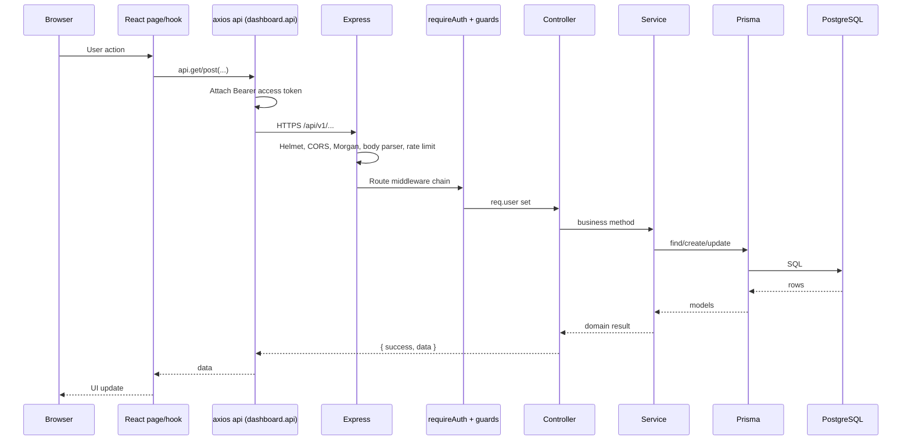
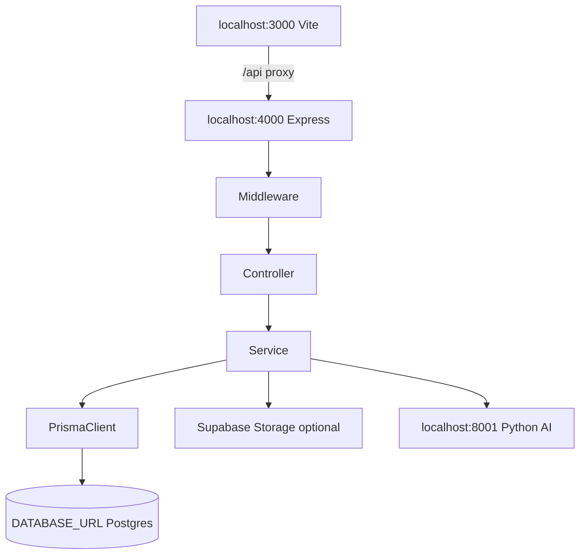
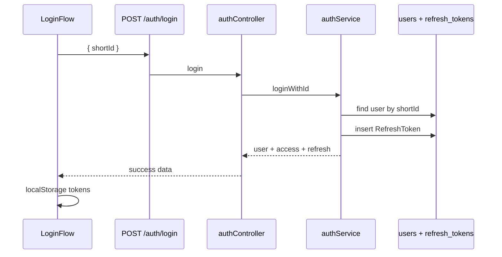
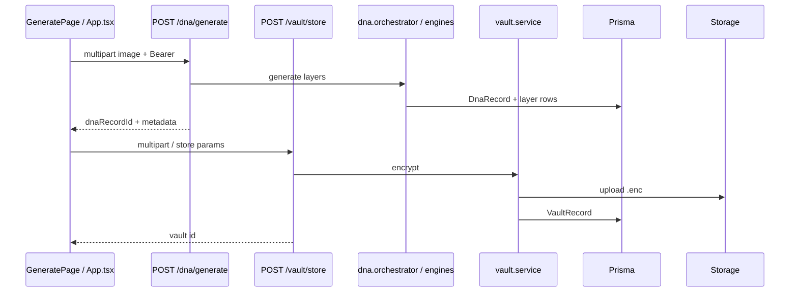
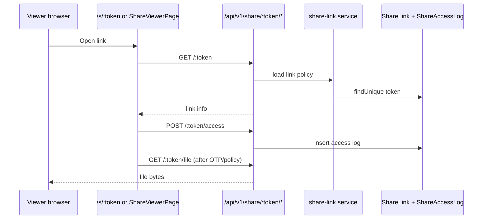
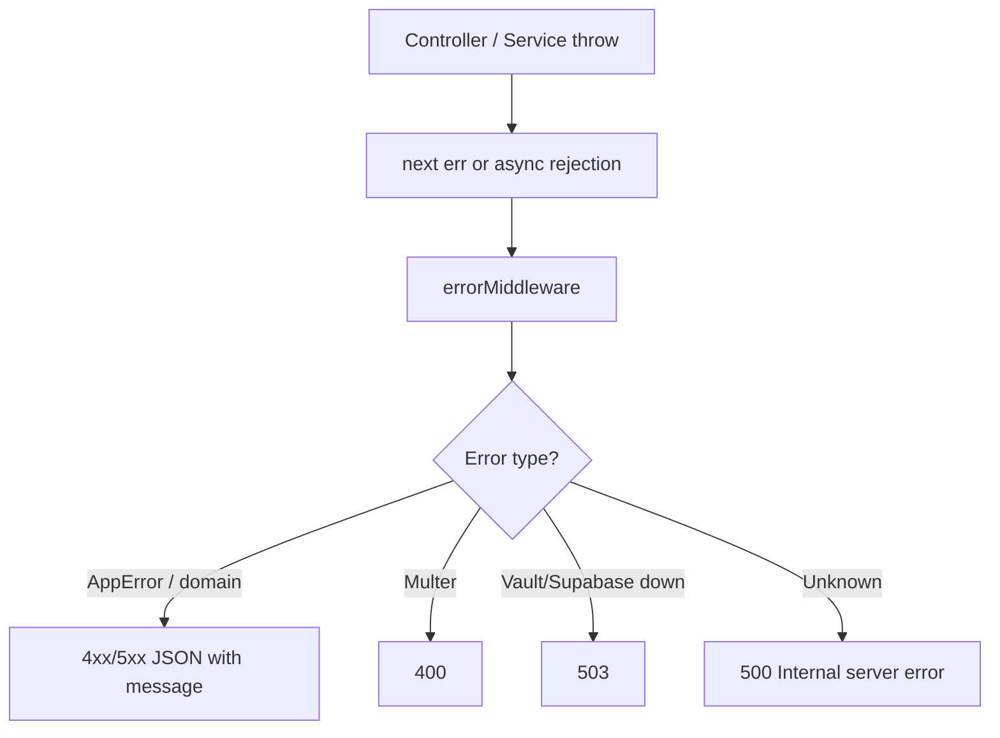
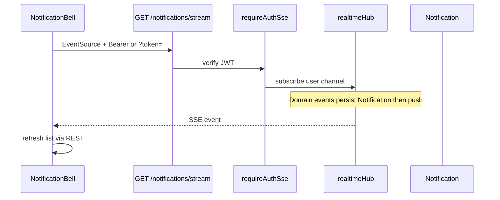

# 08 — Request Flow

End-to-end request paths as implemented in the monorepo.

---

## 1. Canonical stack

```
Browser
  ↓
Frontend (React / Vite)
  ↓
HTTP API (/api/v1) — Express
  ↓
Middleware (CORS, rate limit, auth, ownership, feature, multer)
  ↓
Controller
  ↓
Service
  ↓
Prisma (no separate Repository layer)
  ↓
PostgreSQL
  ↓
Response JSON / file stream
```

Optional side calls from Service: Supabase Storage, Python AI, Tika, Razorpay, crawler provider APIs.

---

## 2. Generic authenticated JSON request



---

## 3. Frontend → Backend → Database (dev)



---

## 4. Login flow (shortId)



---

## 5. DNA generate + vault store



---

## 6. Public share access



---

## 7. Error path



---

## 8. SSE notification path



---

## 9. Layer mapping reminder

| Doc layer name | Actual code |
|----------------|-------------|
| API | `src/api/routes` |
| Controller | `src/api/controllers` |
| Service | `src/services/**` |
| Repository | **Not implemented** — Prisma in services |
| Database | PostgreSQL via Prisma |
| Storage | Supabase / local vault dir |
