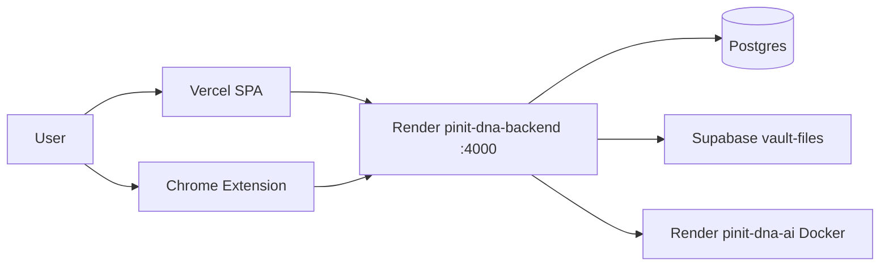

# 10 — Deployment Architecture

---

## 1. Environments

| Environment | How it runs in this repo |
|-------------|---------------------------|
| **Development** | Local Node (`npm run dev`), Vite (`client` port 3000), optional Python AI sidecar auto-start, optional Tika Docker |
| **Staging** | **Not implemented** as a dedicated config/environment in-repo (no staging `render.yaml` flavor or staging env docs beyond general preview URLs) |
| **Production** | Render backend (+ AI Docker), Vercel frontend, Postgres + Supabase Storage |

---

## 2. Development

```bash
# Root — backend
npm install
# Configure .env from .env.example
npx prisma generate
npm run dev          # Express on PORT (4000)

# Client
cd client && npm install && npm run dev   # Vite :3000, proxies /api → :4000

# Optional AI (also auto-started by backend in non-prod)
cd python-ai && setup-venv.bat
# or npm run dev:ai from root scripts

# Optional full stack helper
npm run dev:all
```

Dev aids: `scripts/free-dev-ports.cjs`, `scripts/check-backend-port.cjs`, `predev` hooks.

---

## 3. Staging

**Not implemented in current codebase** as a named staging stack.

Closest options observed in code:

- Vercel preview deployments (`*.vercel.app` allowed by CORS)
- Manual env pointing at non-prod Supabase / Render services

---

## 4. Production topology



Sources: `render.yaml`, `client/vercel.json`, `.env.example`, `CLAUDE.md` deployment checklist.

---

## 5. Build pipeline

### Backend (Render)

From `render.yaml`:

```
npm install --include=dev && npx prisma generate && npm run build
```

`npm run build` → `tsc --project tsconfig.json` → `dist/`.

Start:

```
npm run render:start
→ start:prod
→ normalize-db-env
→ ensure-* table scripts
→ mkdir vault/encrypted + tmp/uploads
→ NODE_ENV=production node dist/server.js
```

### Frontend (Vercel)

```
npm run build   # in client: tsc && vite build
outputDirectory: dist
```

SPA rewrites in `vercel.json` (special handling so `/assets` route is not confused with static files — Vite emits hashed assets under `static/`).

### AI service

Docker build from `python-ai/Dockerfile` (`python:3.11-slim`, system libs for tesseract/ffmpeg/OpenCV, uvicorn).

---

## 6. Deployment process (as configured)

1. Push to GitHub (team process; see `CLAUDE.md`)
2. Render builds backend from blueprint / connected repo
3. Render builds AI Docker service
4. Vercel builds `client/`
5. Set production secrets (`SUPABASE_*`, `VAULT_MASTER_SECRET`, `AI_SERVICE_URL`, API keys)
6. Run migrations (`prisma migrate deploy`) against production DB as part of ops
7. Verify `/api/v1/health` and live SPA

Exact CI workflow files (GitHub Actions) — **verify in repo if present**; primary deploy automation described here is Render + Vercel platform builds.

---

## 7. Environment variables

### Backend (required / important)

`NODE_ENV`, `PORT`, `API_PREFIX`, `DATABASE_URL`, `DIRECT_URL`, `JWT_SECRET`, vault/share/biometric secrets, `SUPABASE_URL`, `SUPABASE_SERVICE_KEY`, `AI_SERVICE_URL`, rate limit, `PUBLIC_APP_URL`, Razorpay keys, crawler flags/keys.

### Frontend

`VITE_API_BASE_URL`, optional `VITE_SUPABASE_*`, `VITE_PROXY_TARGET` (dev), optional `VITE_MAPTILER_API_KEY` (public MapTiler raster tile key — Vercel Hub SPA only; tiles are requested in the browser).

### AI

`PORT`, tokenizer / HF progress flags in `render.yaml`; model cache under `python-ai/models`.

Full template: root `.env.example`.

---

## 8. Docker

| Artifact | Status |
|----------|--------|
| `python-ai/Dockerfile` | Implemented |
| Backend Dockerfile | **Not implemented** — Render Node native runtime |
| `docker-compose` | **Not implemented** |
| Local Tika | Documented as `docker run ... apache/tika` (external) |

---

## 9. Reverse proxy

- **Development:** Vite dev server proxies `/api` → Express.
- **Production:** Render and Vercel provide HTTPS edge termination. Express `trust proxy = 1` for correct client IPs / rate limit.
- Custom Nginx config in-repo: **Not implemented**.

---

## 10. CDN

- Vercel serves static SPA assets (platform CDN).
- No separate CloudFront/Cloudflare config in-repo.
- Share OG preview images are served from the API host (`/share/:token/preview.png`).

---

## 11. Database

| Source | Notes |
|--------|-------|
| Render blueprint DB `pinit-dna-db` | Defined in `render.yaml` |
| Supabase Postgres | Documented in `.env.example` / typical company setup |

App uses Prisma against whichever `DATABASE_URL` is configured. Production may use Supabase even when Render blueprint also defines a DB — **follow the live env**, not assumptions.

---

## 12. Storage

- Production vault: Supabase Storage bucket **`vault-files`** (private).
- Local fallback: `./vault/encrypted` when not production / missing Supabase credentials (`vault.service` USE_LOCAL logic).
- Ephemeral Render disk is **not** durable storage — hence Supabase requirement for production vault persistence.

---

## 13. Keep-alive

In production, if `RENDER_EXTERNAL_URL` is set, the backend pings its own `/api/v1/health` every 14 minutes to reduce free-tier cold starts.
