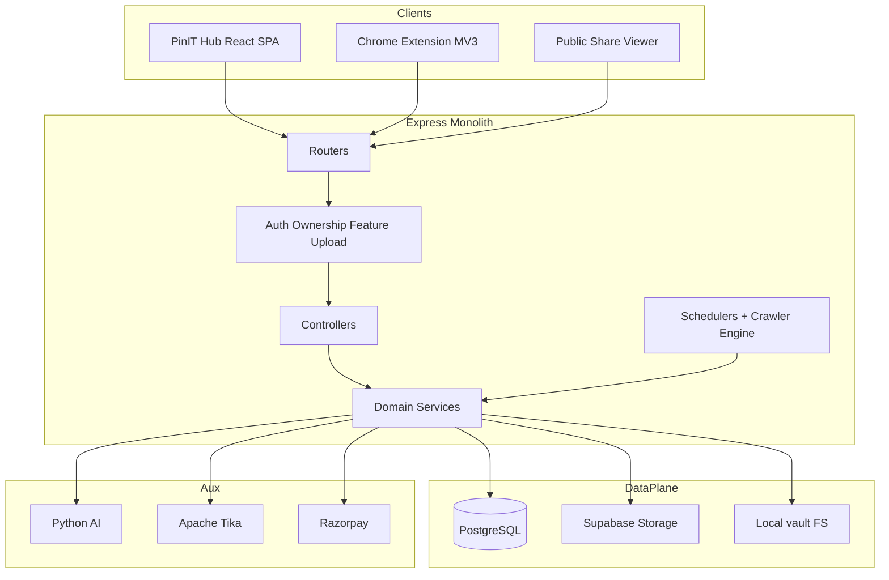
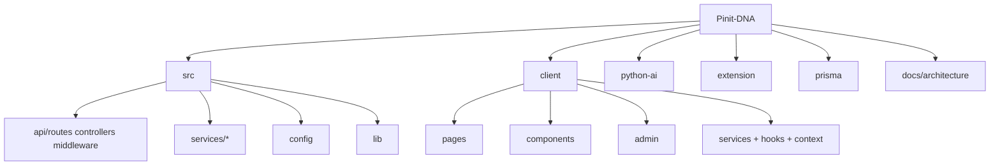
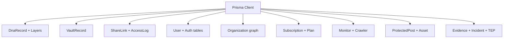
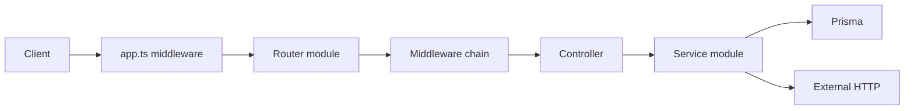
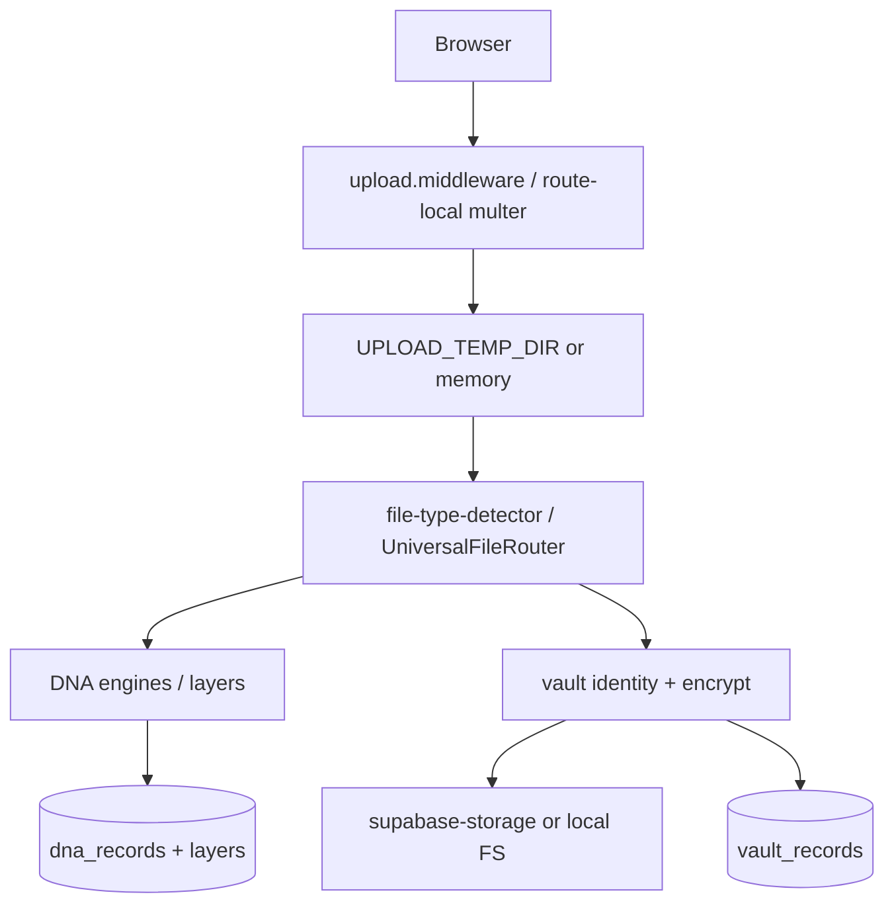

# 11 — Component Diagrams

Mermaid component views of the running system.

---

## 1. Application architecture



---

## 2. Folder hierarchy (runtime-relevant)



---

## 3. Authentication components

```mermaid
flowchart LR
  UI[Auth UI / Face capture] --> AUTHAPI[/api/v1/auth]
  AUTHAPI --> AC[auth.controller / face-auth.controller]
  AC --> AS[authService / biometricAuthService]
  AS --> JWT[jsonwebtoken]
  AS --> RT[(refresh_tokens)]
  AS --> US[(users)]
  AS --> BIO[(biometric_* tables)]
  MW[requireAuth] --> AS
  EXT[Extension] --> CODE[/auth/extension/*]
  CODE --> PGCTRL[publish-guardian.controller]
```

---

## 4. Database components



---

## 5. API flow components



---

## 6. Upload flow components



---

## 7. Notification flow components

```mermaid
flowchart LR
  Domain[Account/Share/Platform events] --> PE[platform-events services]
  PE --> NDB[(notifications)]
  PE --> Hub[realtimeHub]
  Hub --> SSE[/notifications/stream]
  SSE --> Bell[NotificationBell UI]
  Bell --> REST[/notifications CRUD]
```

**Email component:** Not implemented.
