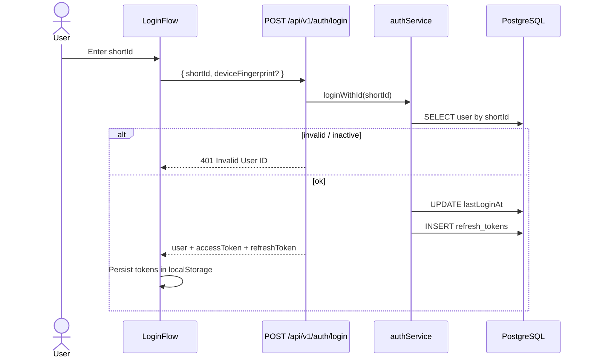
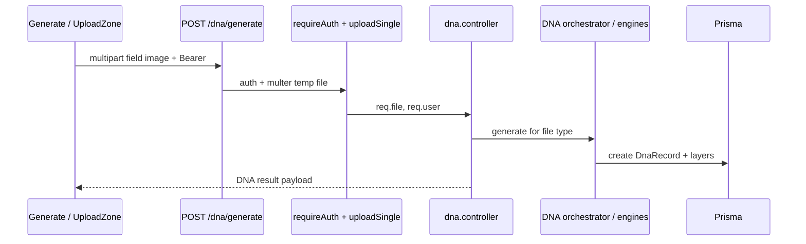
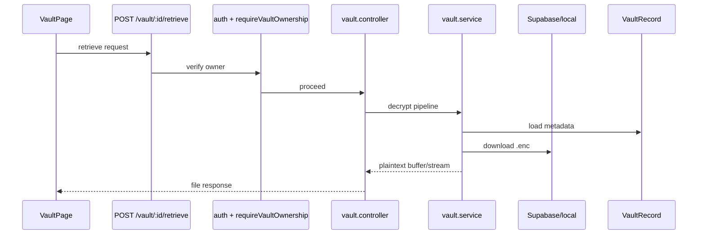
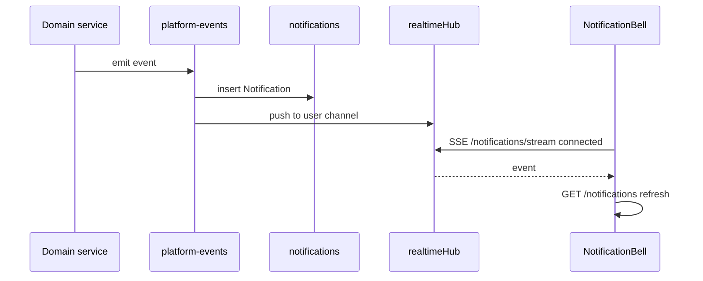
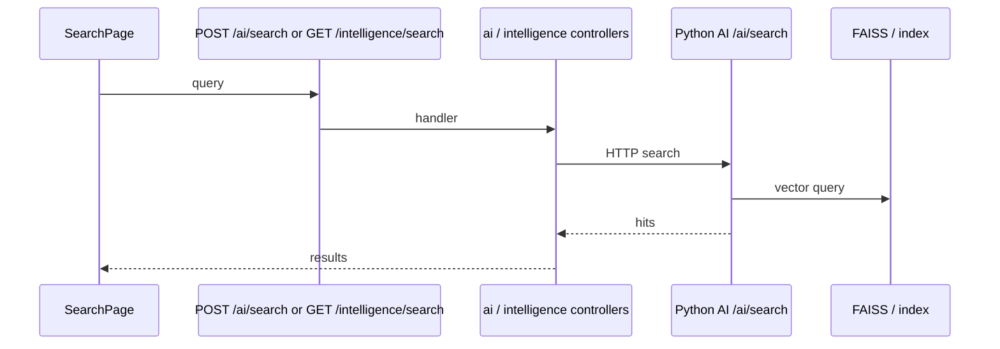
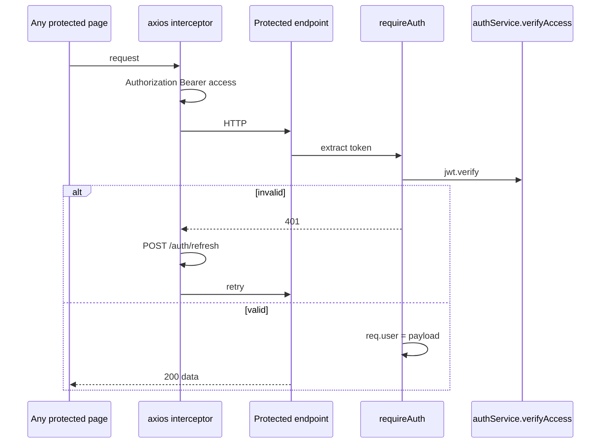

# 12 — Sequence Diagrams

---

## 1. Login (shortId)



---

## 2. Registration (create account)

```mermaid
sequenceDiagram
  actor U as User
  participant UI as RegistrationFlow
  participant API as POST /api/v1/auth/create
  participant S as authService
  participant DB as PostgreSQL
  participant EV as platform-events

  U->>UI: Complete registration UI
  UI->>API: POST /create
  API->>S: createAccount()
  S->>DB: INSERT users (generated shortId)
  S->>DB: INSERT refresh_tokens
  API->>EV: notifyUserRegistered
  API-->>UI: 201 + shortId + tokens
  UI->>UI: Store tokens; continue onboarding
```

Face registration is a separate sequence via `POST /auth/face/register` after or during biometric onboarding.

---

## 3. Upload (DNA generate)



---

## 4. Download / retrieve (vault)



Protected download uses `/protected-download/prepare` then `/protected-download` (TEP-aware).

---

## 5. Sharing

```mermaid
sequenceDiagram
  participant Owner as Owner UI
  participant Create as POST /share
  participant Viewer as ShareViewer /s/:token
  participant Info as GET /share/:token
  participant Access as POST /share/:token/access
  participant File as GET /share/:token/file
  participant DB as ShareLink + logs

  Owner->>Create: create link (FEATURE_SMART_SHARE)
  Create->>DB: insert ShareLink
  Create-->>Owner: token + URL
  Viewer->>Info: load policy
  Info->>DB: find by token
  Viewer->>Access: record viewer metadata
  Access->>DB: ShareAccessLog
  opt OTP required
    Viewer->>Viewer: POST verify-otp
  end
  Viewer->>File: fetch bytes
  File-->>Viewer: content
```

---

## 6. Notifications



---

## 7. Search



Exact path depends on UI calling AI routes vs intelligence routes — both exist.

---

## 8. Authentication (middleware on protected call)


