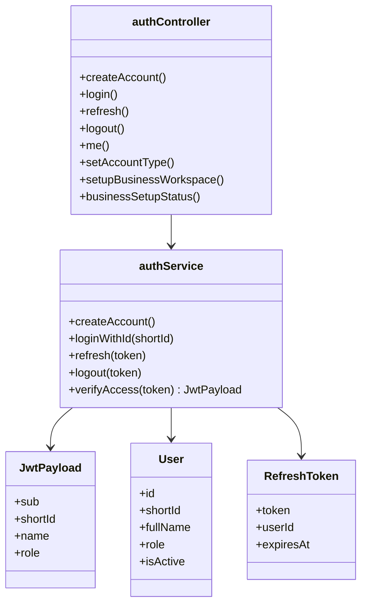
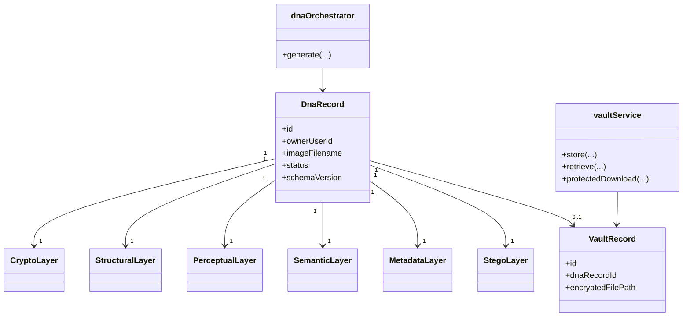
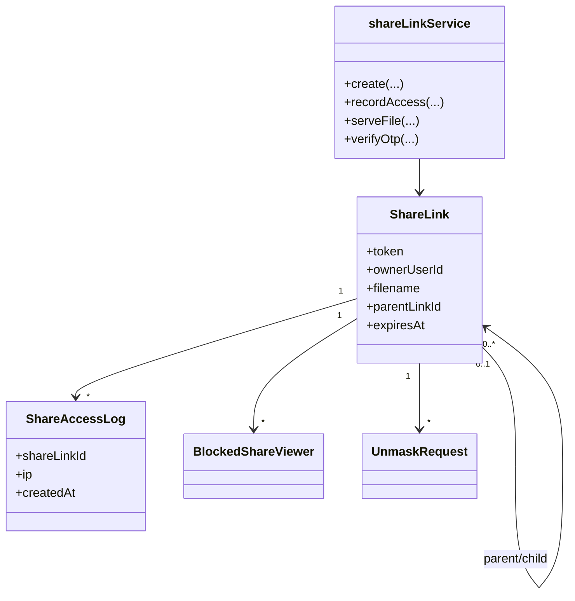
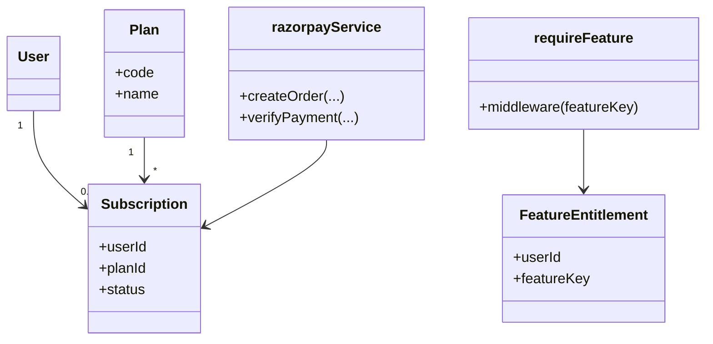
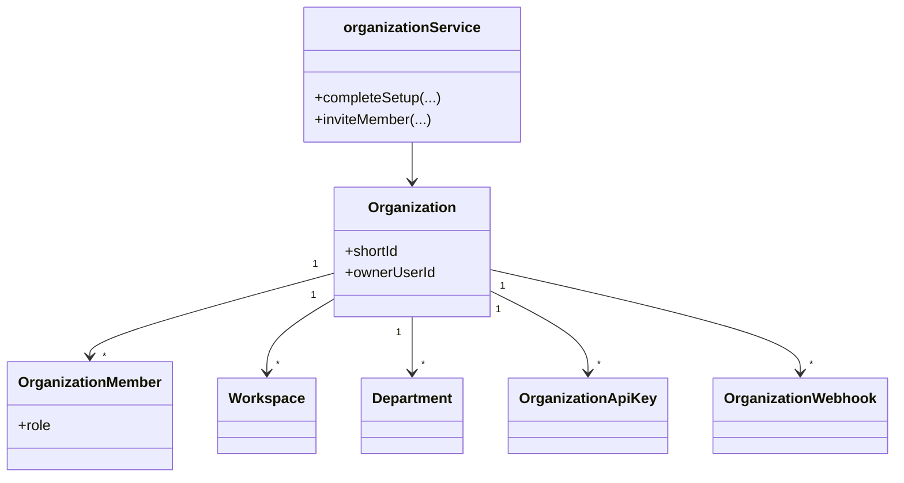
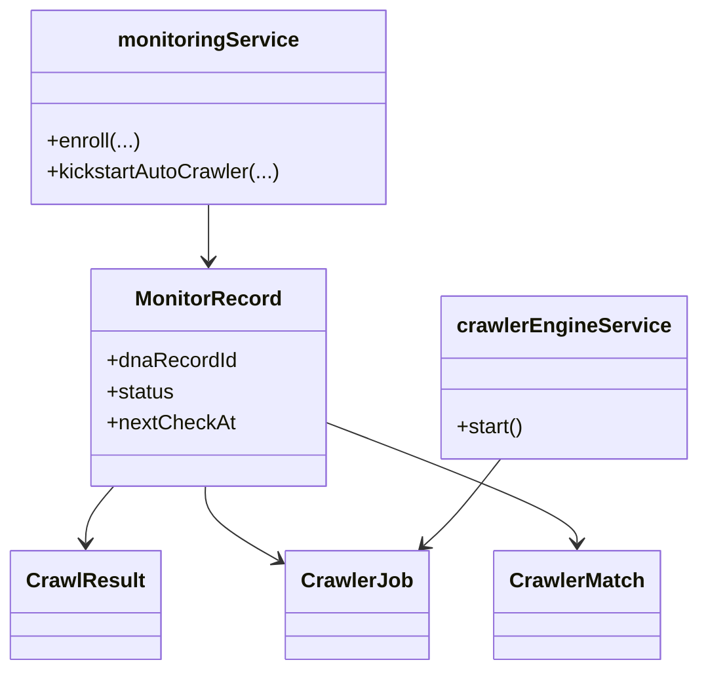
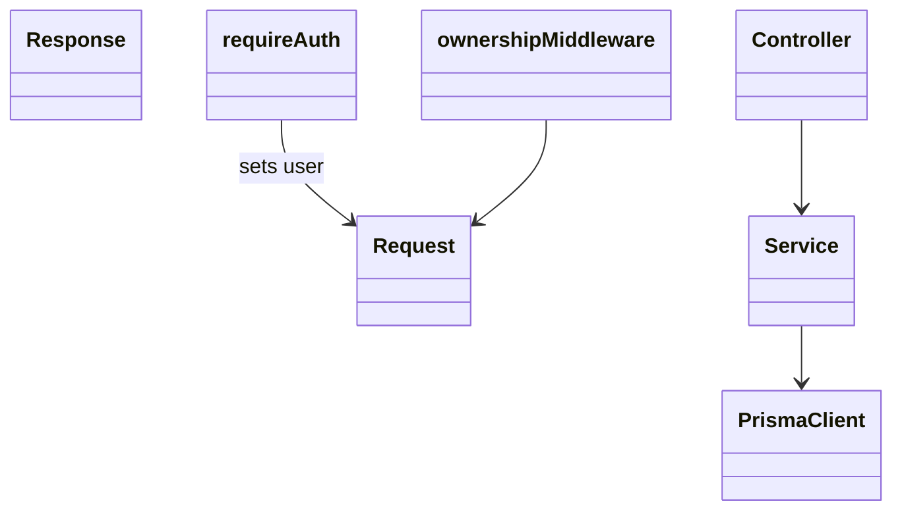

# 13 — Class Diagrams

UML-style class diagrams for major modules. TypeScript uses modules/objects more than classical OOP classes; diagrams reflect **exported services, controllers, and Prisma models** as logical classes.

---

## 1. Auth module

---

## 2. DNA + Vault

Additional layer tables (`BehavioralLayer`, `OriginLayer`, …) follow the same 1:1 pattern — see schema.

---

## 3. Share module

---

## 4. Subscription + feature guard

---

## 5. Organization

---

## 6. Monitoring / crawler

---

## 7. Express request pipeline (logical)

---

## Notes

- Controllers are exported objects of async functions, not ES6 classes — shown as classes for UML clarity.
- Prisma models are the persistent class equivalents.
- Investigation/forensics modules contain many collaborating services (`unified-investigation.orchestrator`, matchers, scorers); treat `src/services/forensics/` as a package with an orchestrator façade rather than one class.
